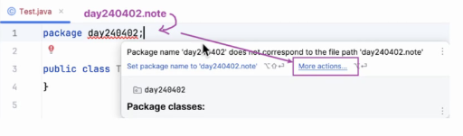
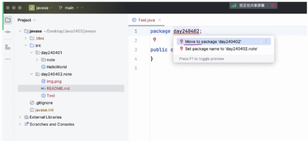
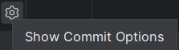
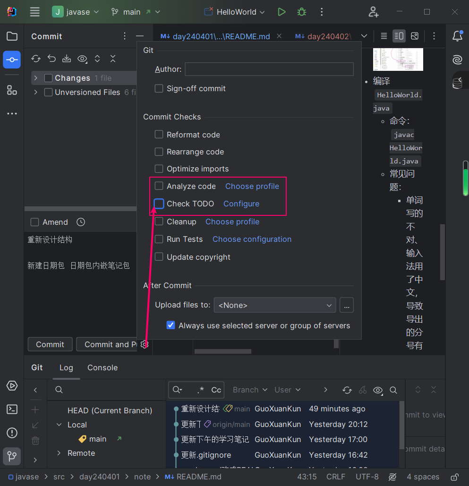
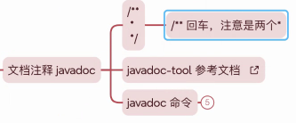
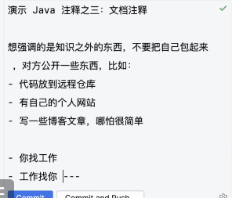
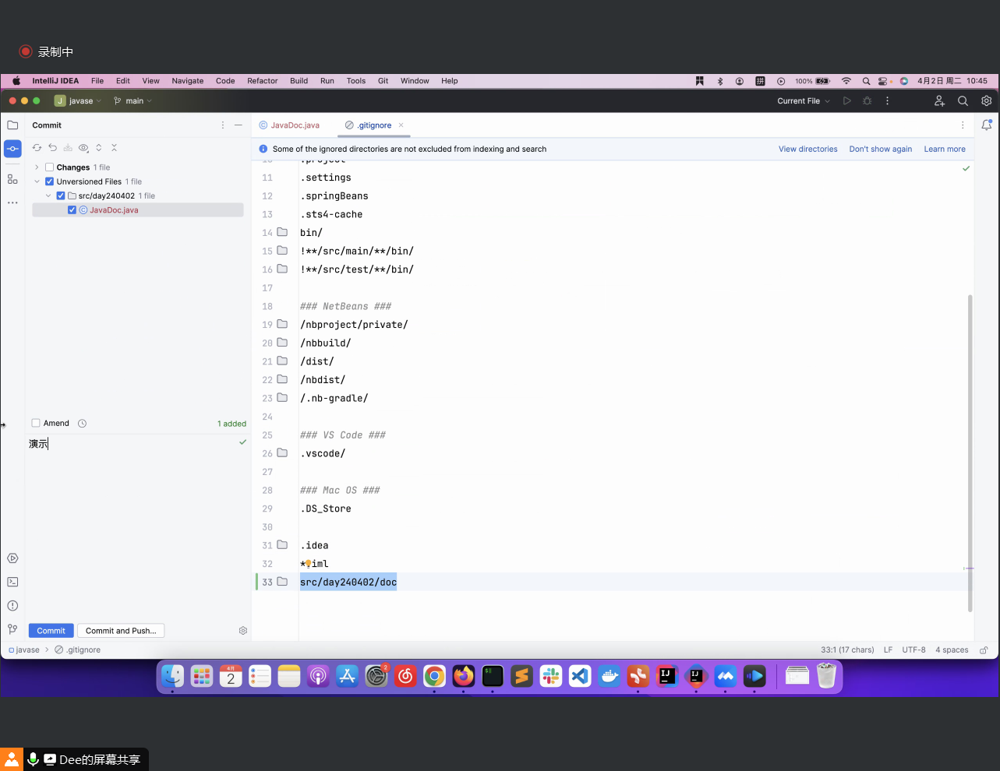
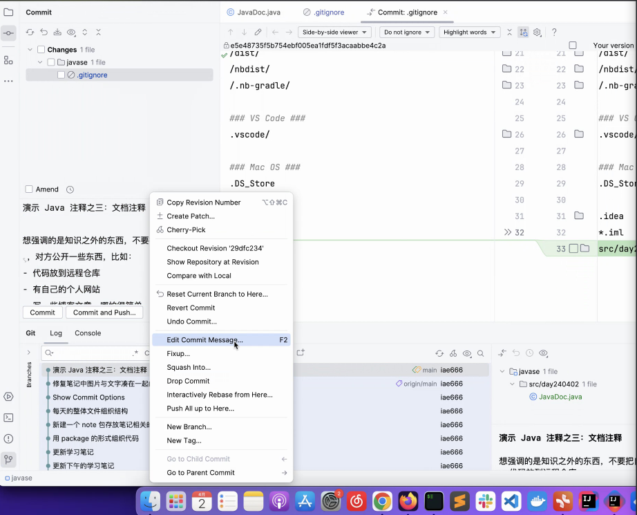
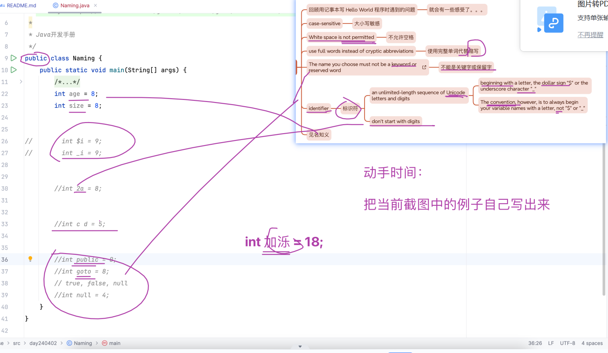

# 笔记

## 上午
###
- 
- 
- 取消commit提示!
  
  
### 文档注释 注释内容可以被生成html
    
    

### commit 屏蔽doc
    

### 还没push到远程仓库 还能再编辑commit
    

### 命名的重要性
> 编程最重要的不是算法...,而是命名.
- 注册GitHub Gitee 的用户名
- 仓库名
- 项目名
- 文件名
- 类名
- 笔记的名称
- 配图的名称
- commit 消息 
- ps: 
  - 简历上 java 开发工程师 是错的 ,Java 开发工程师才是对的
  - 英文 中文中间加个空格
### 命名的规范 官网(https://docs.oracle.com/javase/tutorial/java/nutsandbolts/variables.html)
- 名字要好懂
- 
- 

### 技巧:
    - 给自己提示:`...`表示有不止一行的内容