# 笔记 2024年04月03日

## 上午

### 查看git绑定的邮箱
- 命令行窗口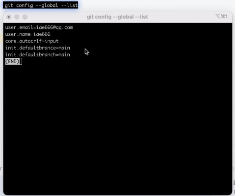

### Gitee的邮箱要跟git的邮箱一样,Gitee主页贡献度统计的代码才会被统计
- 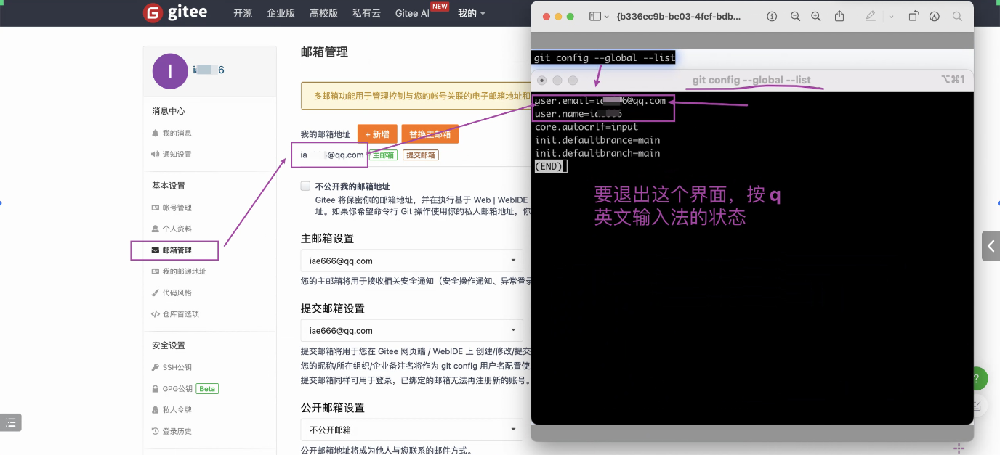

### 数据类型(部分)
- (必考) 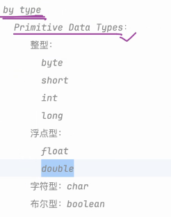 (使用时要考虑有效范围)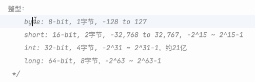
- char 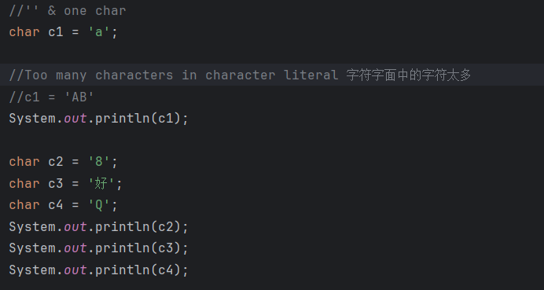
- 转义字符 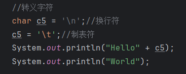
- 

### 赋值
- 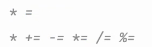

### 字面量 Literals
- 如果是整形,默认是int型 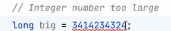 long类型: (L/l都行,但是用L,这样不容易看错) 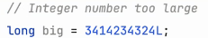
- 如果是浮点型,默认是double,要想定义成float,要在数字后面加F/f(最好用大写,理由如上:大写识别度更高)

### 数字_分隔:
- 定义int 数据中加_不影响原值内容,但是观看的时候更友好 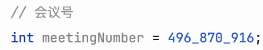 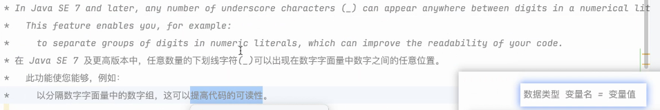 ps: 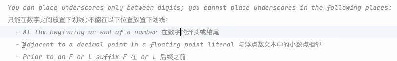
- 多个 ___ 是可以的 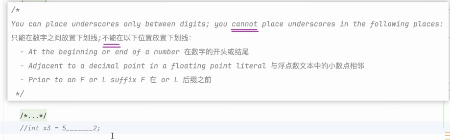
- 表示金钱 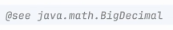

## 下午

### byte,char,short 在进行计算会先转成int
- 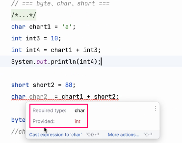

### ++ , --
- 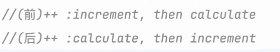

### 取余
- 起作用的是被取余的数 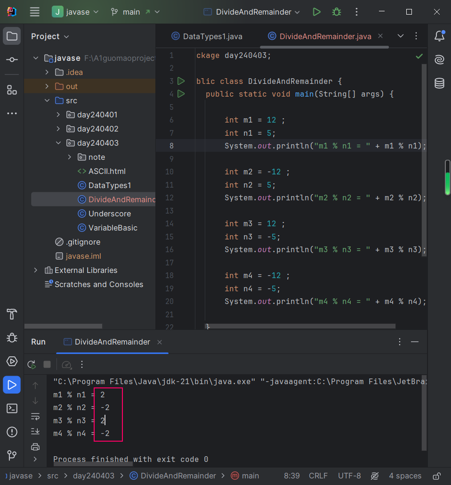

### += 包含了强制转换
- 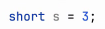 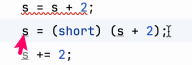

### 细节 :
- commit 内容尽可能详细
- 可以用英文来写(可以锻炼写英文与看英文的能力)

### 技巧 :
