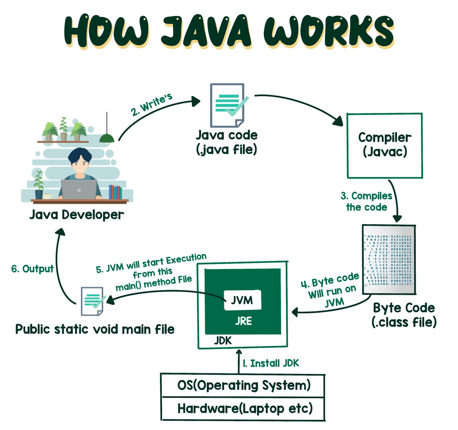
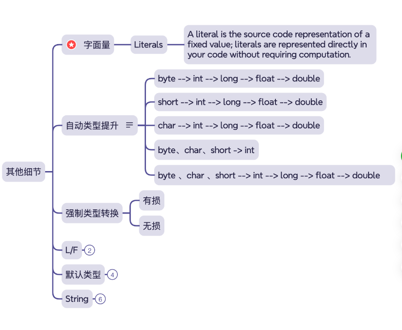
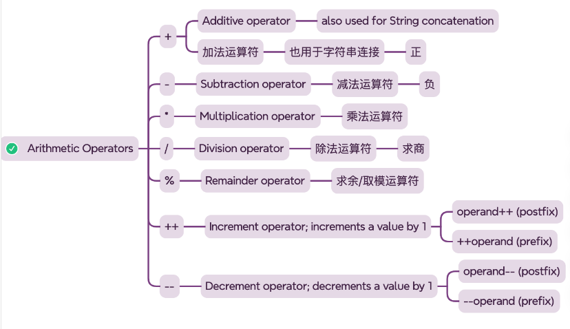
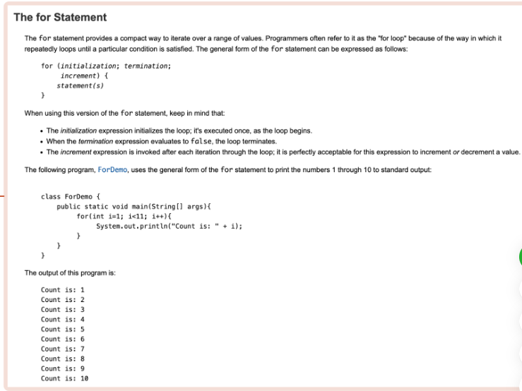

# weekly review 

### Monday

- 工具准备:
  - JDK21 
  - IDEA
- 用记事本写 HelloWorld
- How Java Works
  - 
- Gitee
  - 注册Gitee
  - Gitee 创建仓库
  - IDEA 将本地代码进行版本控制

### Tuesday

- 命名的重要
- 命名的规范
- 先轮廓,再细节
  - 先理思路,可以以注释的方式写下来
  - 将思路以代码形式表现出来
  - ps:先从宏观到微观,把握大体走向,再丰富细节
- 干净的卷面 与 带有草稿的页面
  - 把想法下来,把思考的过程写下来
    - 1.使思考具有连贯性
    - 2.表现出思考的过程
    - 3.方便校验
- 慢 与 快
 - 在适当的时候让自己慢下来
   - 1.调整节奏或者是心态
   - 2.流水不争先,争的是源源不绝.
   - 3.停下来回头看看,是为了更好的向前走

# Wednesday

- 数据类型
  - 类型之间的转换
  - 
- Arithmetic Operators
  - 
- 循环结构 --for
  - 
   

