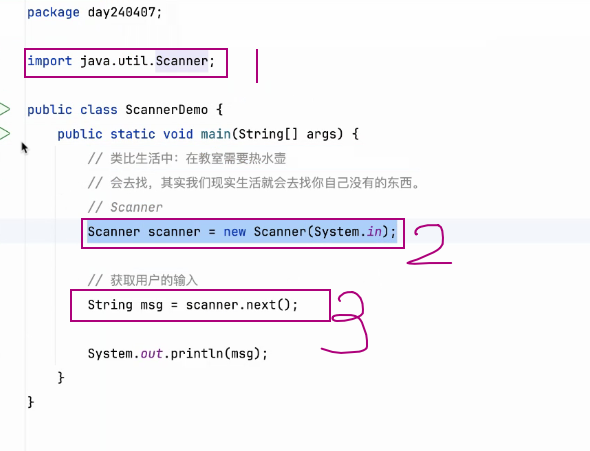

# 笔记 240407

## AM

### 给自己的笔记做个目录
 - 方法:
   - 可以在总文件夹里加个 README.md 然后在里面加个链接 

### 仓库更改默认分支
 - 

### 字符串拼接符 `+`
 - 字符串和其他类型 `+` 拼接 最后的结果是字符串类型
   - 

### 自己加限制,激发自己的创造力

### IDEA 不要打开上次关闭时的界面
 - 

### 交换数字
- 

### 接收用户输入
- 
- 

## PM

### 循环结构
  - for{ ; ; }
    - 适用于: 循环次数明确
  - while()
    - 适用于: 循环次数不明确
  - do{ }while()
    - 适用于: 循环次数不明确, but 无论如何都要执行一次
  - 
  - 

### 生成随机数
- Random
  - 
- 做 猜字游戏
  - 步骤:
    - 1.从需求出发 (整体情况什么样,命名先命好)
    - 2.如果是1次该怎么做
    - 3.考虑循环该怎么做
    - 4.循环结束的条件,怎么结束循环.
    - 代码 Guess and Charades

### 自己解决不了的问题 :
- 生活中如此,写代码也是如此
  - 找工具
  - 求助

