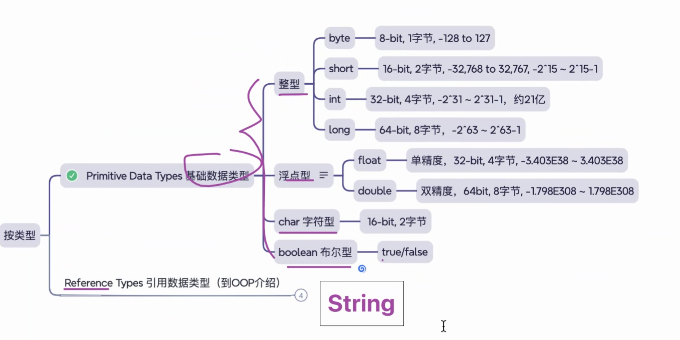
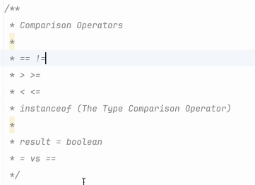
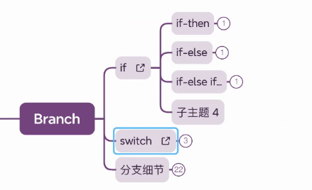
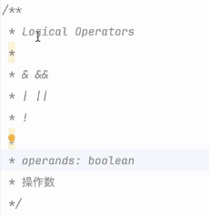
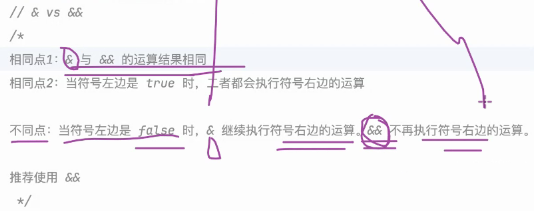
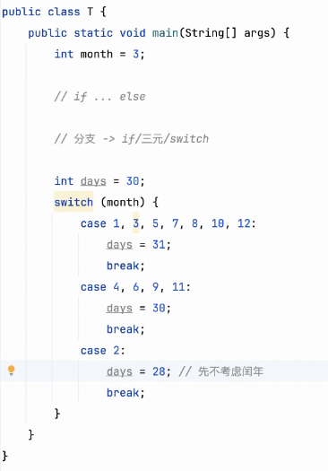

# Note 24.04.08

## AM

### review
- 命名的规范
  - 

### 数据类型
- 

### 编程
- 算法 + 数据结构
- 本质: 数据 + Operator 操作
  - 算法
    - 顺序
    - 分支
    - 循环
    - 递归

### 比较
- 

### 分支
- 
- 三元运算符
  - 
- switch...case
  - 

### 逻辑运算
- 
- 与 `&&` `&`
  - 
- 或 `||` `|`
  - `||` 左边计算能出结果,就不会再进行右边的计算
- 非 `!`

### 练习 
- FindMonthDay
  - 
  - 

### DRY
- Don't repeat yourself

## PM

## Thinking

### 看问题、看事物
- Zoom In/Out 放大/缩小 (宏观,微观)
- Rotate 旋转 (多维度)