# Note 240409

## review
- 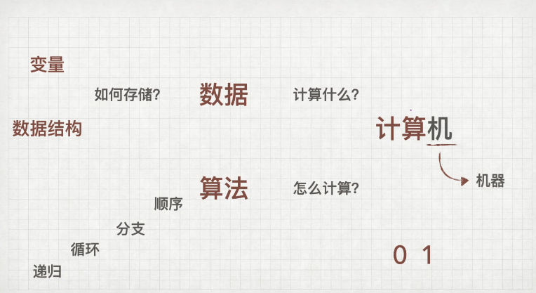
- 旧版本要去了解

## AM

### 数组 Arrays
- 首地址 a[0]
- 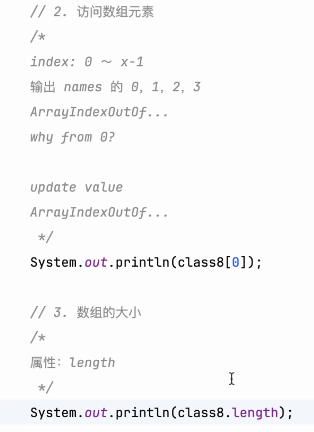
- 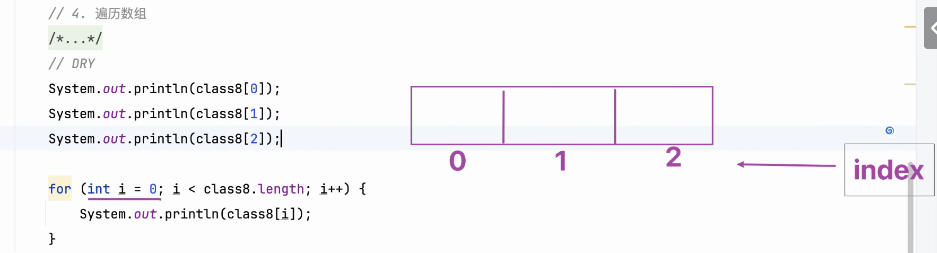
- 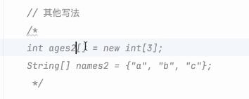
- 规范
  - 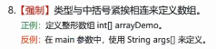

## PM

### 面试的本质
- 面试官要的是什么
  - 筛选 
  - 如何才能脱颖而出
- 表达很重要,如何把脑子里的表达出来
- 哪怕真的不会,不要留白.
  - 大大方方承认自己的不足,去面对它
- 灵活的题要的绝对不是答案
  - 或许是表达
  - 注意数形结合 (想想ppt怎么做)

### 遇到复杂的问题
- 大问题化成小问题,直到,小到能解决问题,再,慢慢解决大一点的问题.

### 
- 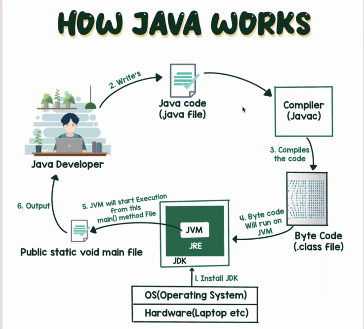
- 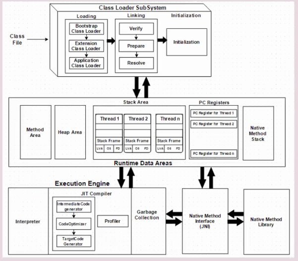
- 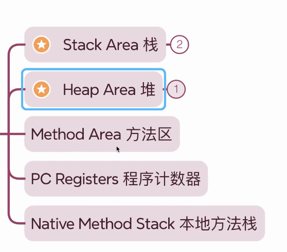
- 栈区 Stack Area
  - 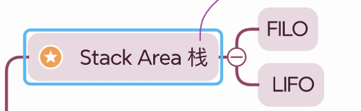
- 堆区 Heap Area
  - 

### 数组 没赋初值
- 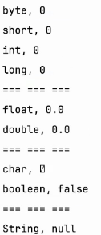
- char 的0 不一样
- 非基础8个类型 都是null

### 内存图
- 遇到方法 在栈区 分配一个 栈桢 有一个scope
- 元素组件都在 scope里面
- new 在堆分配空间
- 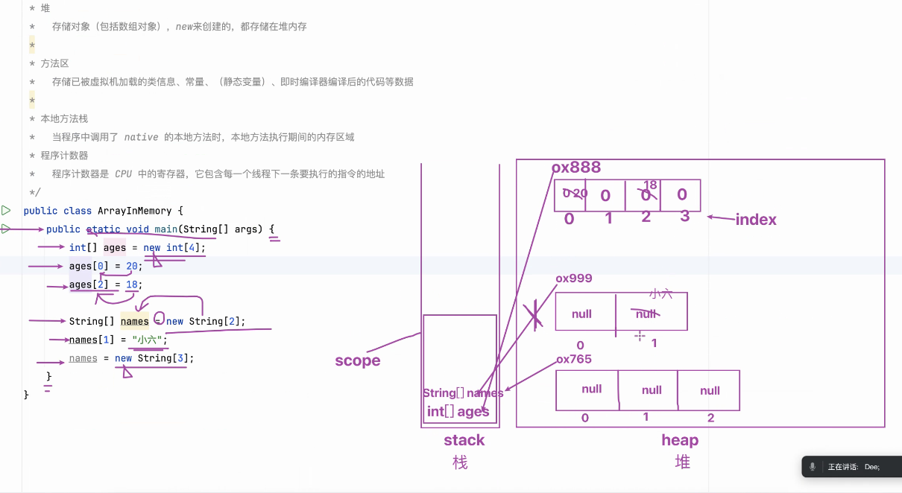

### 更改 main 里的 String[] args
- 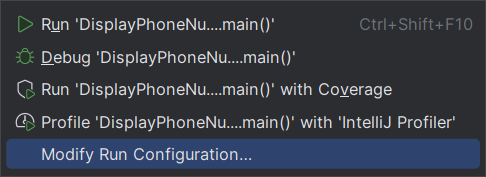
  - 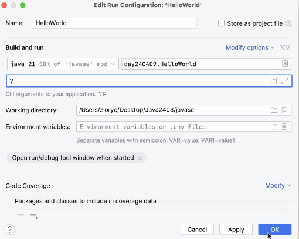
- 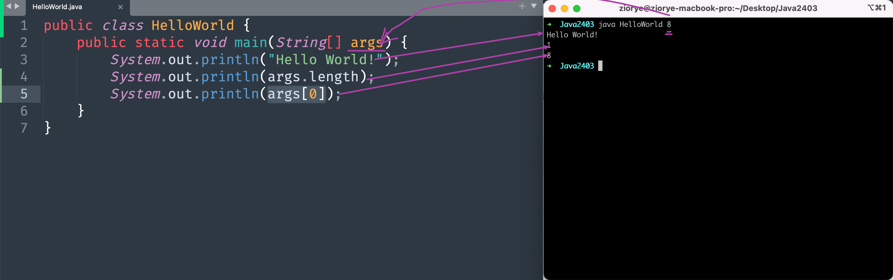

### 遍历数组
- 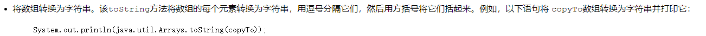

### 冒泡排序