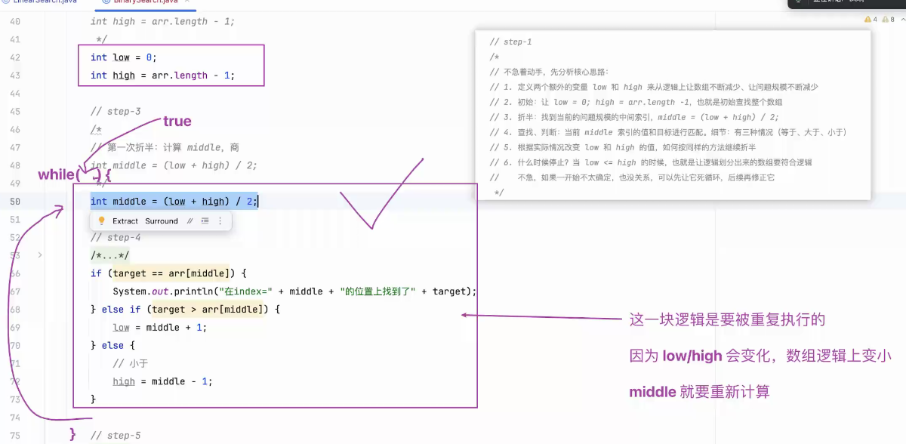

# Note 240410

## Review
- 
- 思考的角度多维化
  - 比如:考试的目的,面试的目的
    - "过滤"
      - 大纲 知识点 掌握程度
- 数组声明规范(阿里巴巴版)
  - 
- 隐藏在数组中的电话号码
  - 
- 数组的初始值
- 内存分析
  - 
  - 
- String[] args
  - 
- 练习
  - 

## AM

### 内核要强大
- 勇于想象
- 勇于思考
- 勇于表达
  - 锻炼表达, 可以讲给零基础的人听

### 移动代码
- // ctrl + shift + 上下键

### 六边形
- 笔记丰富一些
- 命名规范一些
- 英文多看一些

### 打印数组数据
- 

## PM

### 折半查找
- 
- 
- 
- 
- 通过命令窗可以确定跳出循环的式子
  - 
- `哨兵`的确认其实是从里到外
  - 
- 辅助线的概念
  - 
  - 

### Tool
- 算法:查找 动态 可视化
  - https://visualgo.net/zh/sorting?slide=7

