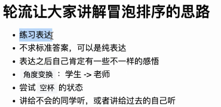
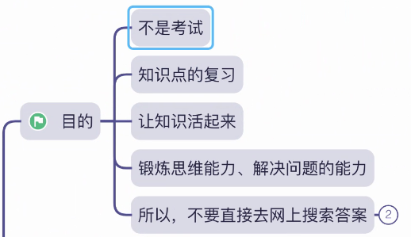
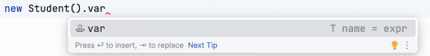

# Note 240411

## Review
- 表达练习
  - 
  -  笔记也是表达
  - // 注释也是表达

- 教育的本质
  - 忘记知识点之后,还存在的东西
    - 习惯
    - 解决问题的思路
    - 看待问题的角度
    - 眼界
    - 思维
    - 格局
    - 思想

- 冒泡排序的练习
  - `辅助线`的思想

## AM

### 练习的本质
  - 

### 类

### 实例化的快捷键
- 