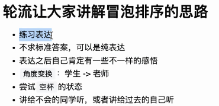
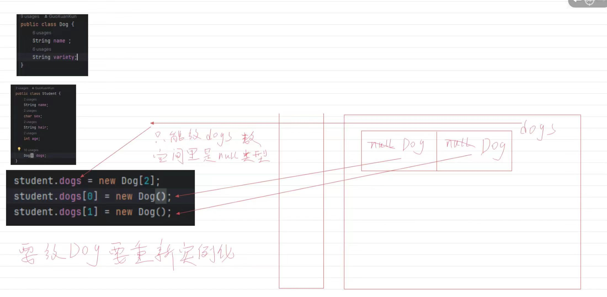
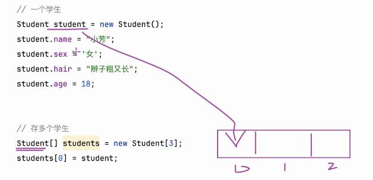

# Note 240411

## Review
- 表达练习
  - 
  -  笔记也是表达
  - // 注释也是表达

- 教育的本质
  - 忘记知识点之后,还存在的东西
    - 习惯
    - 解决问题的思路
    - 看待问题的角度
    - 眼界
    - 思维
    - 格局
    - 思想

- 冒泡排序的练习
  - `辅助线`的思想

## AM

### 练习的本质
  - 

### 赋值
- 

### 类
- 构造类 
  - 
- 实例化
  - 类型 名称 = new 类型 {类(),数组[]}
    - 
  - 对象数组的实例化
    - 
    - 
      - 内存图
        - 
### 实例化的快捷键
- 

## PM

### 面向对象与面向过程
- 面向对象 (Object)
  - 包含面向过程
- 面向过程
  - 解决问题的具体方法和思路
- 面向对象 和 面向过程 并不是对立存在的

### 对象
- 什么是对象?
  - 
  - 
- 本质就是 state (状态) 和 behavior (行为) 

### class 类 
  - 
  - 就类似于 工厂里的模型 或者 叫设计稿
  - 建模 
    - 
    - 

## 遗忘的
- 数组的实例化
  - 
  - 
  - 