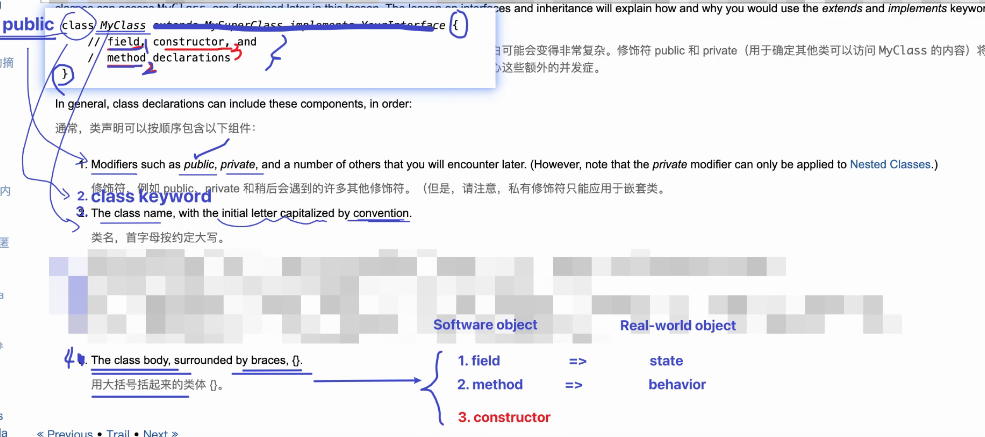

# Note 240412

## Review

### 代码也是画笔 , 灵感来自于自然以及需求

## AM

### OOP 面向对象程序设计
- 

### OOP -> OOA (分析) / OOD (设计)

### 内存图练习
- 

### 类
- 
- 
- 

## PM

### 类 与 对象
- 
- 怎么定义模版
  - 

### 变量
- 

### private
- 

### 方法的声明 (method declaring)
- 

### 构造器 (constructor)
- 
- 
  - 用法
    - 
### 之后一段时间的习惯
- 

