# Note 240415

## Review
- OOP
- Object
  - 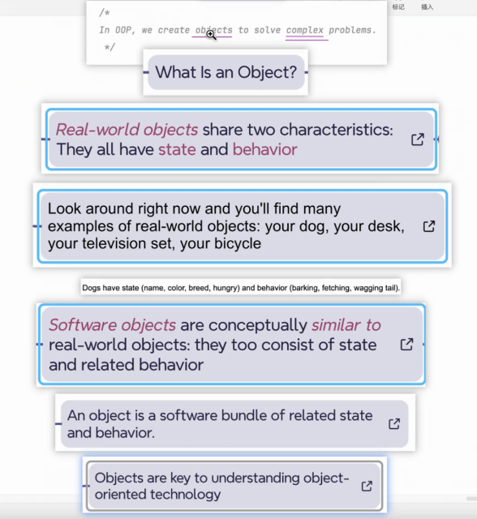
- 内存图的目的
  - 辅助理解代码
- c / c++ 多用于 计算机底层 注重性能
- 类的声明
  - 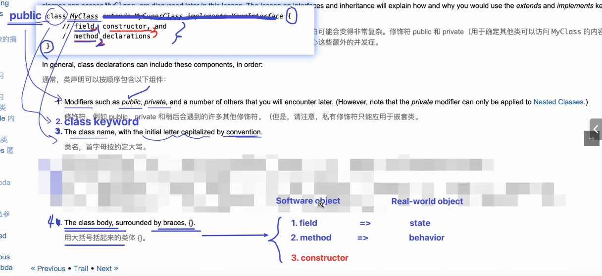
- fields
  - 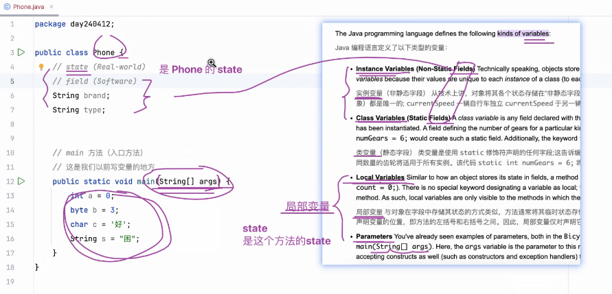
- method
  - 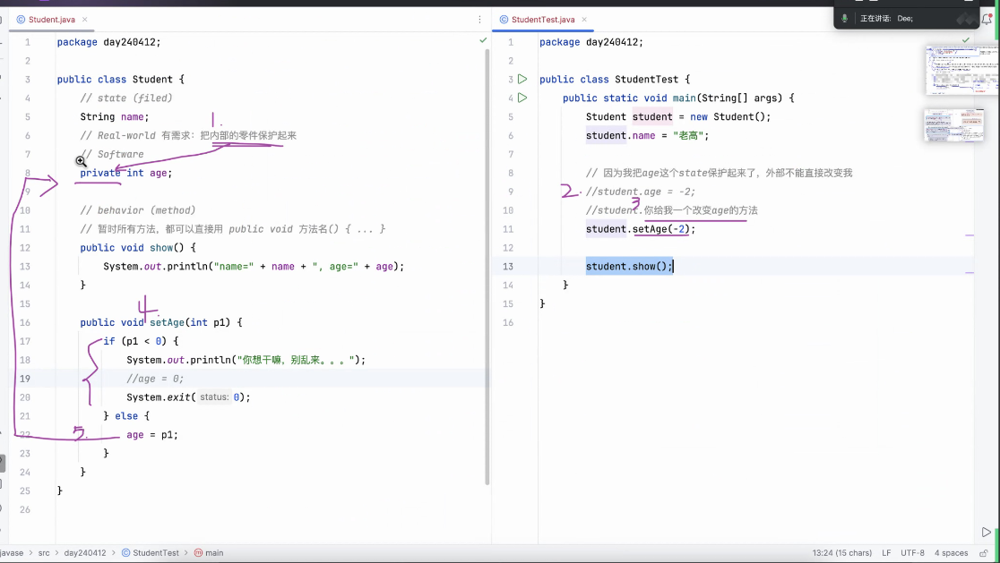
  - 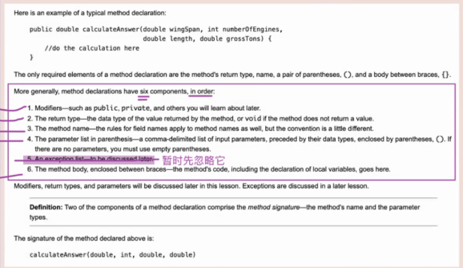
- 构造器 constructor
  - 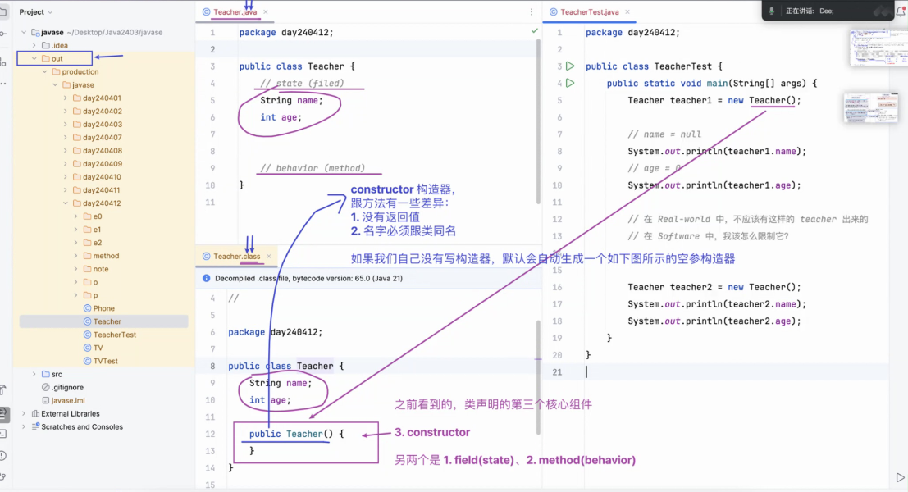
  - 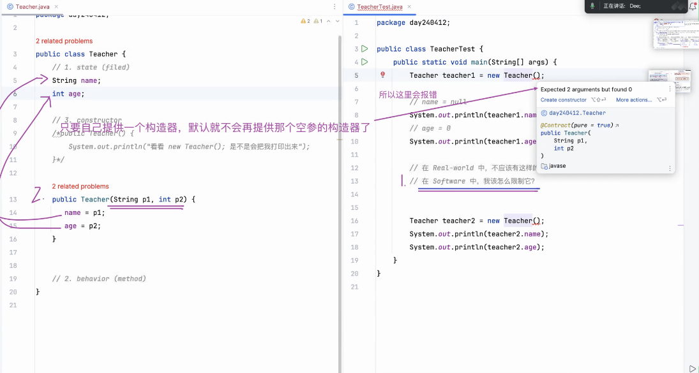
- 基础数据类型
  - 四类八种
    - 整型,浮点型,字符,布尔 
      - 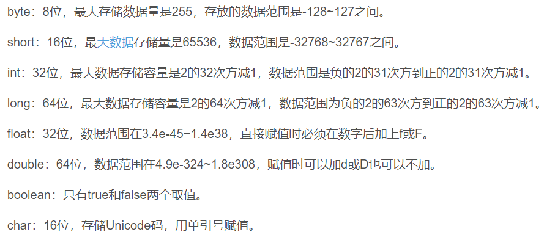

## AM

### Practice
- 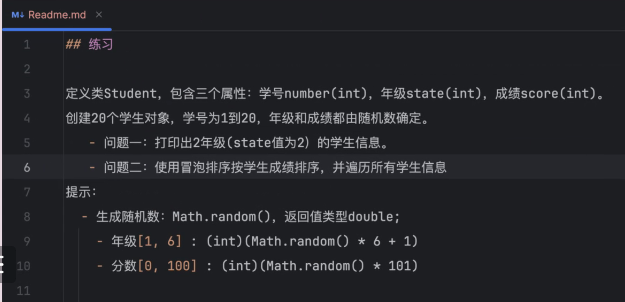
  - 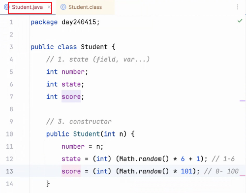

### constructor 的目的就是给实例赋初始值

## PM

## OOP的核心流程
- 
- OOP
- Object
  - 找本质
  - state / behavior
  - real World object
- class (为了批量生产Object)
  - field
    - 变量类型 变量名 = 变量值
      - member valueable (有默认初始值)
      - 局部变量 (必须初始化)
        - locol valuable
        - Para
  - method
    - 六个关键元素
      - 1. 访问权限修饰符
      - 2. 返回值类型
      - 3. 方法名
      - 4. 参数
      -  ***  
      - 6. body 方法体 
  - constructor
    - 给实例的state赋初始值    - 
  - software object
  
### static (静态)
- 不需要依赖任何个体,就可以使用
- 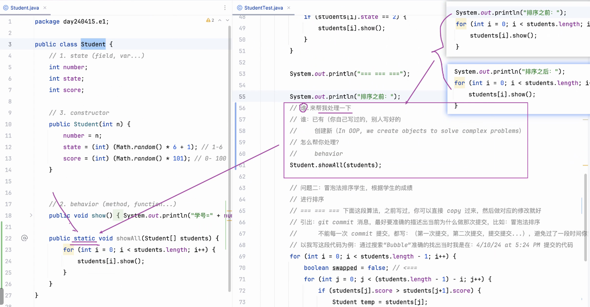

### overload 重载
- 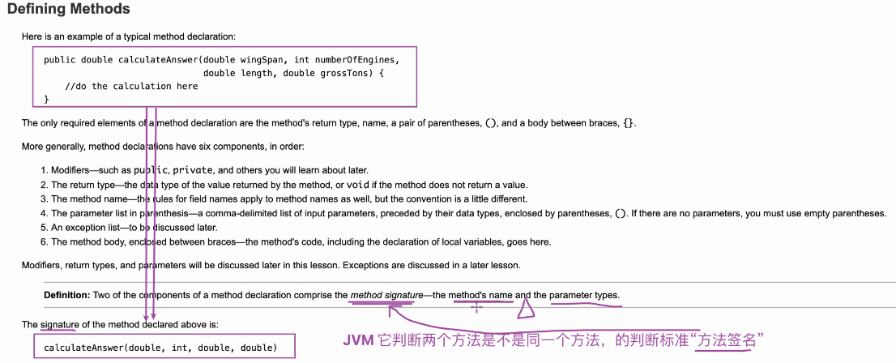