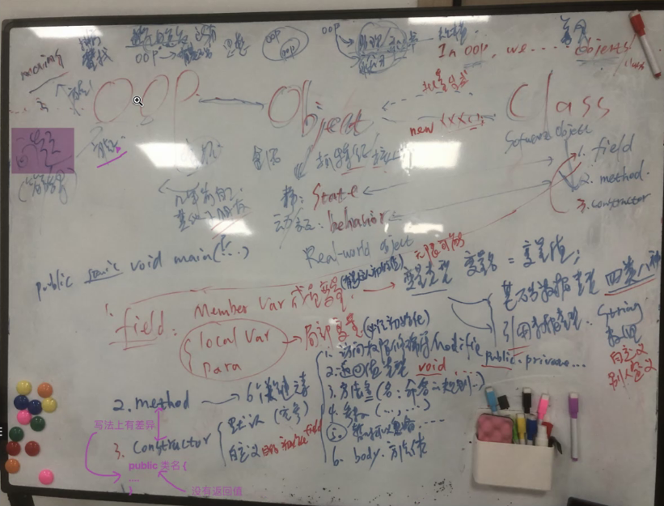
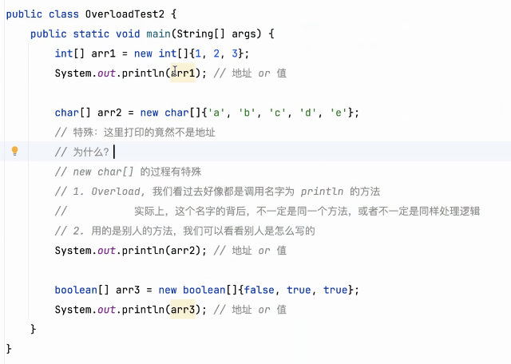
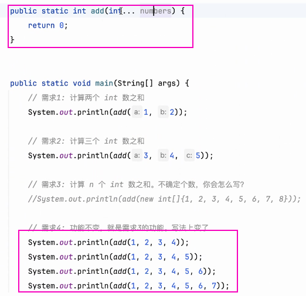

# Note 240416

## Review
- 
- 
- 

## AM

- Overload 重载
  - 
    - 
    - Q2:
      - 
    - Q3:
      - 
      - 并没有,调用了 double 的方法
      - double 和 int 可以相互转换

### 面试题
- 
- 
- 
- 

## PM

### 计算 n 个 int 数之和。不确定个数
- 
- 

### commit 怎么用
- 提交笔记时,附带 程序 以及 图片 方便之后回看

### 验证数据类型方法
- 
- 

## 思维
- 规矩也是人定的 
  - 编程语言 本身会变, 编程语言 也是在解决问题
- 转换立场看问题
  - 为什么他会问出这个问题 目的是什么 想的是什么?
- 找本质的过程有时候不是一蹴而就的,要接受中间懵懂的发展过程,事物是呈螺旋式发展,接受这个过程,不断前进,直到迎来质变的那一刻

## Tool
- IDEA 的 todo ( 待做功能 )
  - 
- Git 的用法之一
  - 

## 团建活动 (第一次)
- 亮点
  - 你画我猜配合的不错
  - "谁是卧底" 猜的不错
- 这次团建不擅长的项目
  - 听歌识曲 萝卜蹲
- 团队 (本次团建作为小队队长的思考)
  - 是否调动起了队友的积极性
  - 是否让队友的长处充分发挥出来
  - 和 "盟友"订的 "盟约" 是否准确的传达给队友