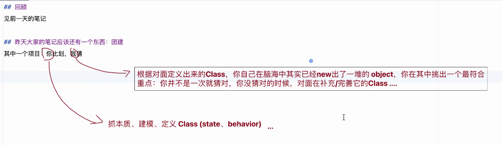
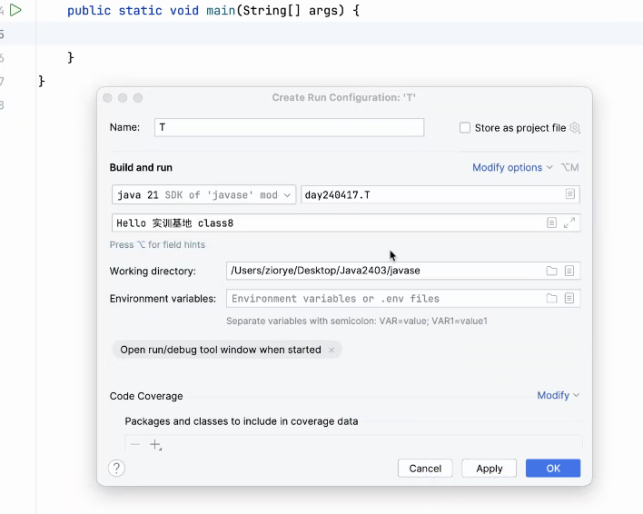
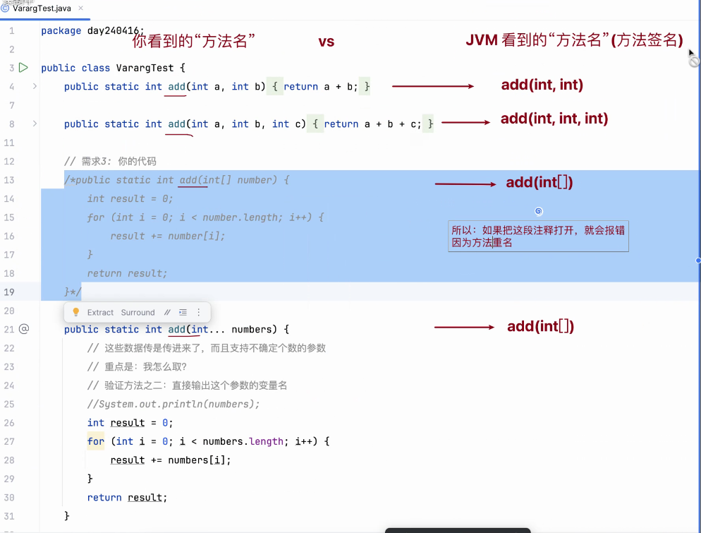
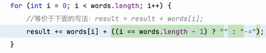
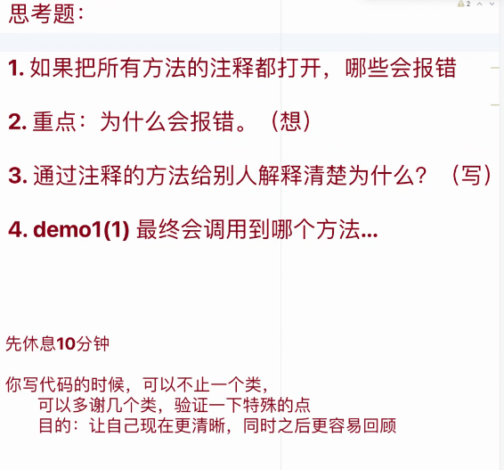
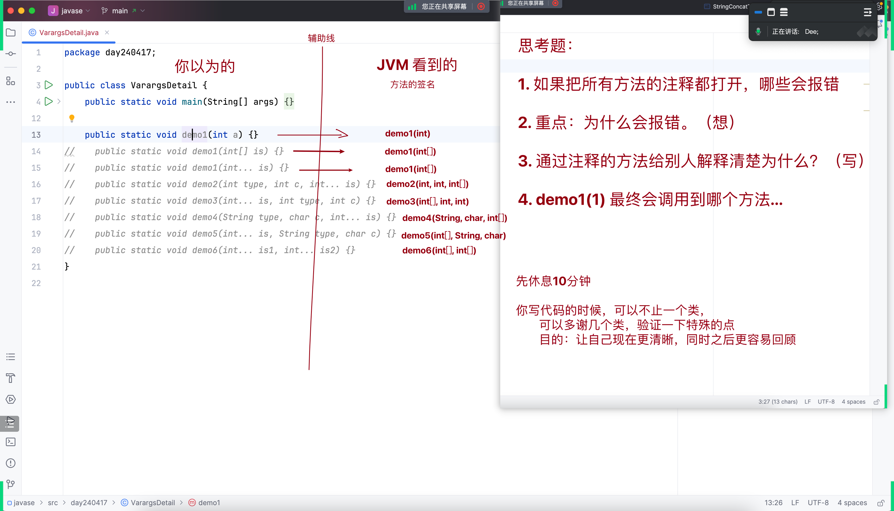
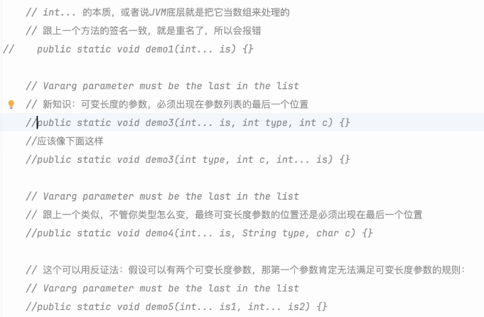
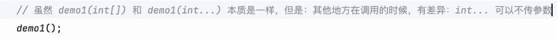

# Note 240417

## Review
- IDEA 的 todo
- 知识要串起来,整成体系
- 团建回顾
  - 项目: 你比划我猜 其实就是一个在 抓本质 , 建模 , 创建 class , 由猜的人进行 实例化 , 的过程,
  - 

## AM
- args 设定初始值
  - 
- JVM 看到的 “方法名” （方法签名）
  - 

## Practice
- 拼接字符串 (这里用了三元运算符)
  - 

## PM

###  思考题
- 
- 
- 
- 

## 学习
- 举一反三 （点 -> 线 -> 面）类似于思维导图的方式 串起来
- 反证法
  - 学习或者考试都能用这个方法

## 思维
- 何为 `归零心态`
  - 代入新生的角色 ，婴儿学步的态度 ， 认识 学习 事物与知识  

## Tool
- Git 版本控制
  - commit 如何善用?
    - 可以将细节拆成点 一点一点来进行 commit (提交)