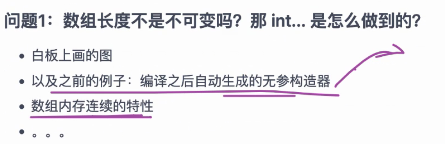
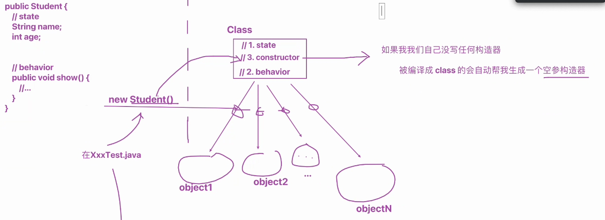
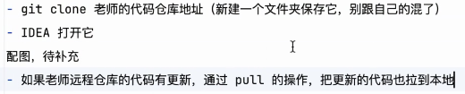
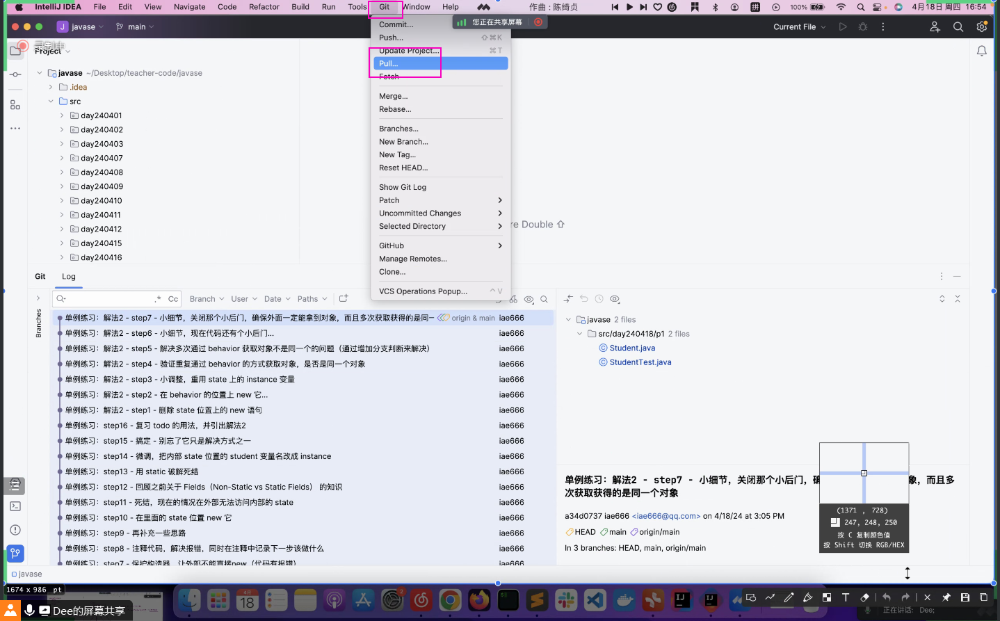
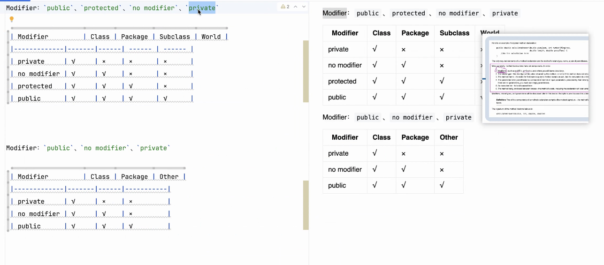

# Note 240418

## Review
- 思考题
- 数组长度不是不可变,那 int... 是怎么做到的?
  - 

## AM

### new 一个 Class 实际上就是在调用 Class 的 constructor
- 
- 

### 写代码的过程 (自己有录屏)

## PM

### 查看老师远程仓库的代码
- 线上直接看
- 远程 pull 到 本地

### 远程代码仓库 pull 到本地 (time 16:10 左右)
- 

### 远程更新了怎么 pull 到本地
- 

### 访问权限修饰符
- 
