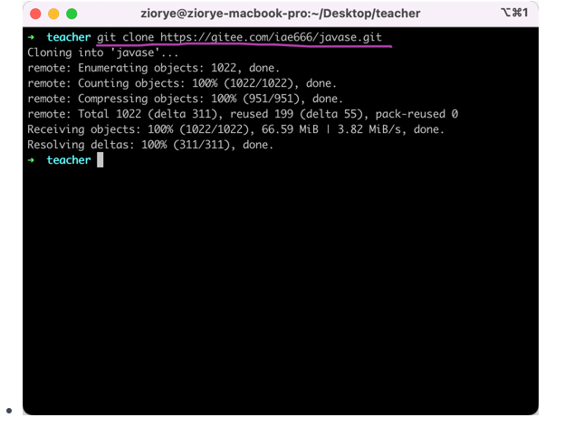

# Note 240419

## Review
- 访问权限修饰符
- 查看别人远程仓库

## AM

### 怎么使用老师的代码
- 要知道老师的远程仓库地址
- 保存到本地
  - 
  - 
  - 
  - 
  - 
- 查看老师的提交记录
  - 
  - 
  - 
- 获取老师更新之后的代码
  - 

### **this** 关键字
- 对当前对象的引用

## Month Review
### stage_0
- 
- 浏览器视频倍数
  - 