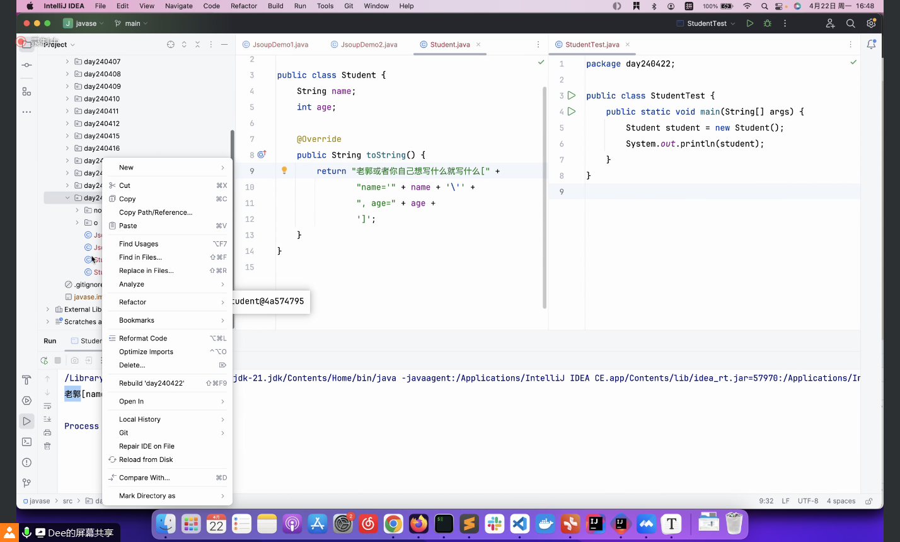

# Note 240422
## Review

## AM
### 修改远程仓库地址
- 

## PM

### 浏览器 怎么读懂 html 的 
- 本质上是 将 html 看成 document
  - 
- 

### 思考 : 如何让 Java 也听懂 HTML
- 

### sources 和 javadoc 
- 
  - Javadoc
    - 可以从Java源代码中提取类、接口、构造方法、方法和变量的注释来生成API的HTML文档。
    - Javadoc可以理解在Java源代码中的特殊注释格式（Java注释以 /** 开头，以 */ 结尾）。例如，对一个方法进行注释，Javadoc将知道这是描述该方法的注释。
  - sources 是源文件

### 导入 Jsoup 的 .jar 文件 (目的)
- 网站: https://jsoup.org/
- 
- 
- 
- 
- 
- 
- 
- 

### toString 没调用却能输出
- 只要能输出类的地址或者这个类,能自动调用
- 

## 思维
- 常用久用的工具,多花心思,多花时间,去选择好一点的,不要吝啬,不是去追求高价值,而是追求最高体验感
- 把让自己不舒服的地方,记下来,说不定一个好的产品就来自这里
- 有时候一个工具不会用,不妨试着去用,猜功能(假设作者是自己,那会提供什么功能,同时通过这个过程来提升自己写代码的能力),不一定要去找操作手册,当然找手册这个操作是操作是对的,不要怀疑.
  - 
- 要把自己具备知识 + 自身想象力或是需求 变现成产品的想法以及能力

## 问题
- 现学的技术能不能改变视频的分辨率
- 可不可以保存视频
- 能不能做一个抢票 app