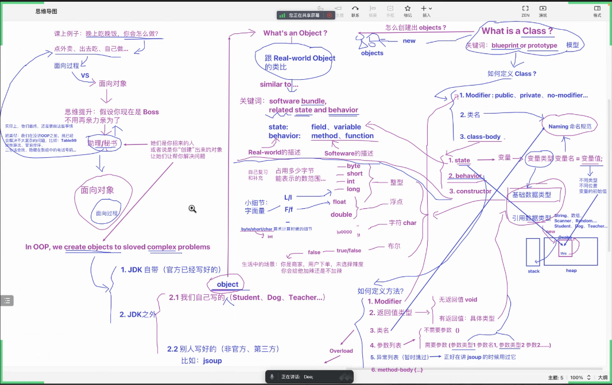
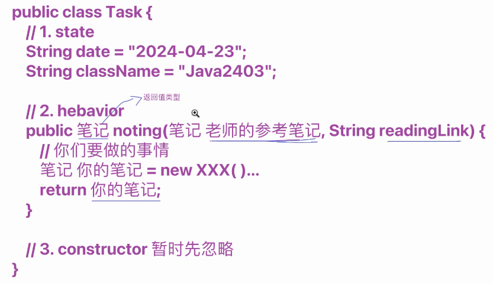
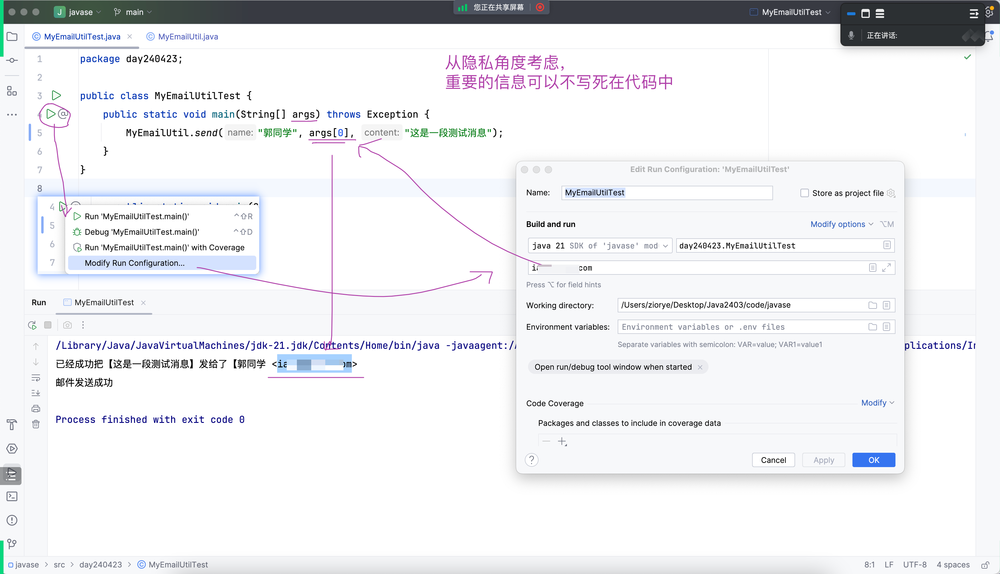
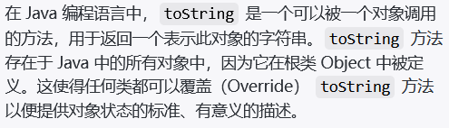
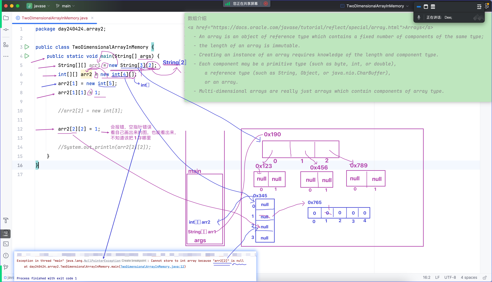
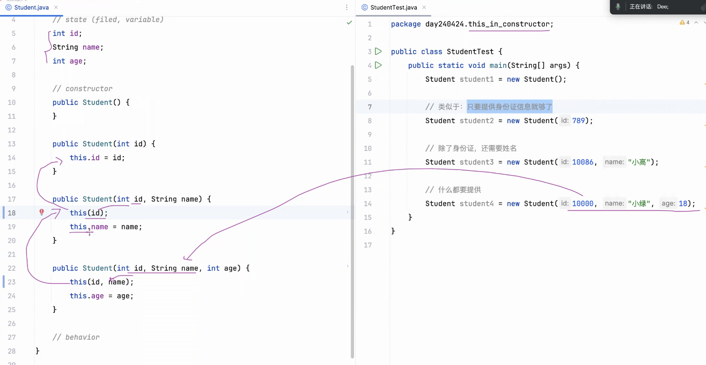
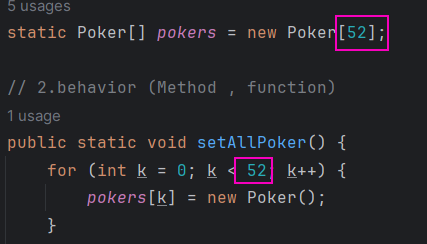

# Note 240424
## Review
- 浏览器插件
  - 哔哩哔哩插件
- oop 的思维导图
  - 
- 万物皆可建类
  - 

## AM
- 写代码得注意隐私
  - 
- toString()
  - toString 是一个可以被一个对象调用的方法，用于返回一个表示此对象的字符串。
  - 

## PM
- assert 校验语句
- 数组
  - 二维数组
    - 一维必须长度必须确定
    - 内存图
      - 
- this 与 constructor 的联合用法
  - 细节 Call to 'this()' must be first statement in constructor body
  - 

## 技巧
- 同种数字 作用一样可以抽离出来 这样改参数会方便很多
  - 
