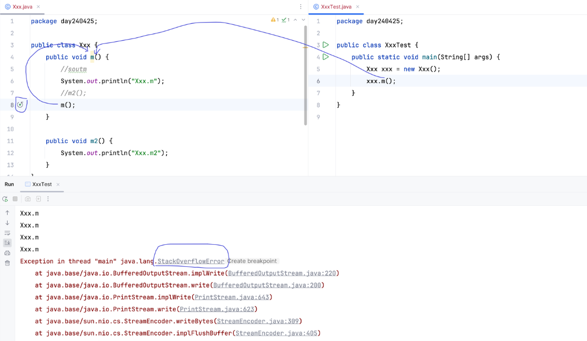
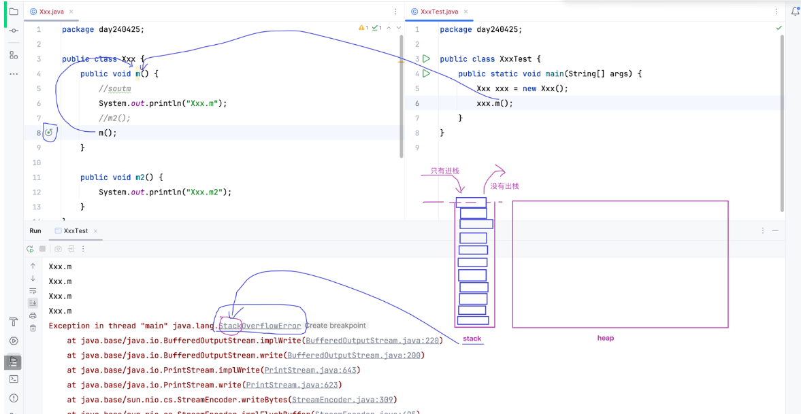
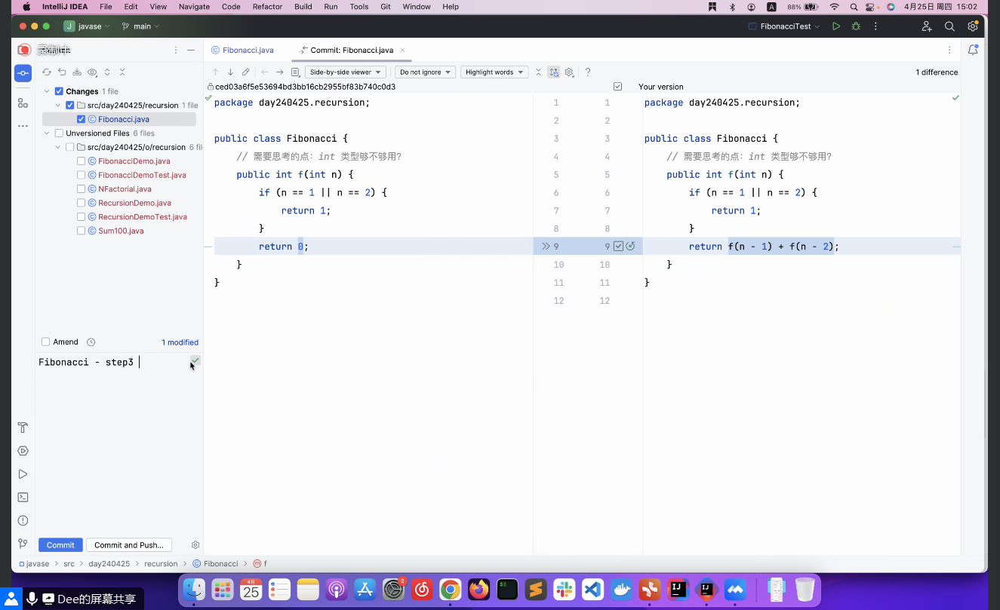
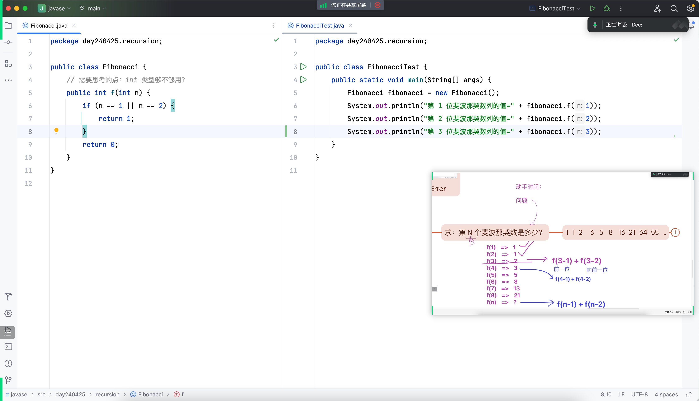
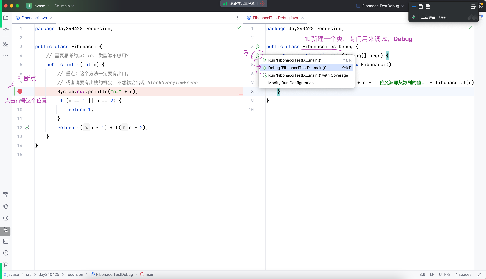

# Note 240425 

## Review

## AM

### 对外
- 作品可以对外公开
- 个人网站要及时更新,并且用自己的知识不断去更新和美化它

### 判断两个字符串是否相等 equals
- 不能直接用 ==
  - 

### 递归
- 两个特性
  - 基本条件：确保递归在有限的步骤之后停止。
  - 递归步骤：在每个递归调用中，算法应尽可能接近基本条件。
- 
  - 内存图分析
    - 

## PM
### 递归
- 用法: 找到规律 写出最后要递归的式子 设置出口 让他去计算 
  - 斐波那契数列
    - 
    - 

### 断点 + Debug
- 
