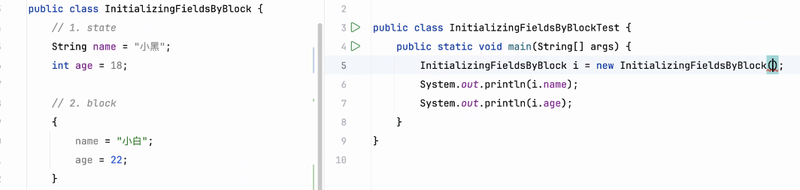
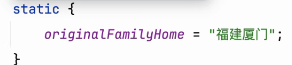
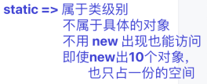
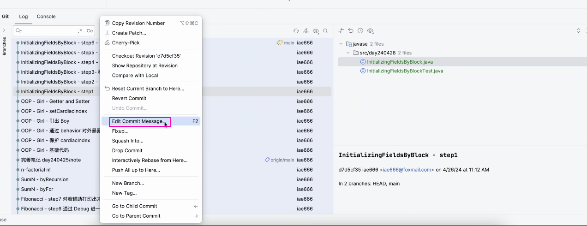
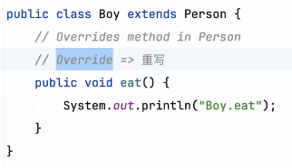
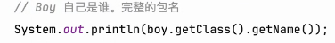
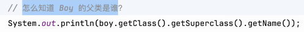
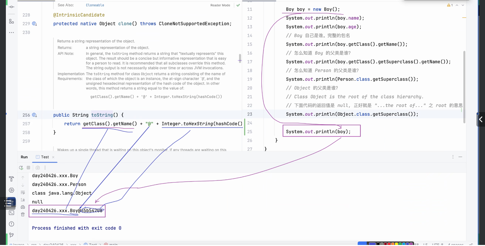

# Note 240426

## Review
- 见前一天的笔记

## AM
### block
  - block 是在 new 的时候才进行赋值的 
  - 
  - 在一个类里面赋值的优先级
    - constructor > block > state(fields,Variable)
  - 要 赋值 static 的值 应该如下图:
    - 

### Static 通过类名去访问它
- 

### 修改 commit 的消息
- 还没提交到远程 , (提交了最好不要进行此操作)
    - 

## PM

### final 
- 数值不能再被改变

### Math 类
- 有 PI 圆周率

### 命名规范 : 如果 state 是Static 同时是 final 修饰的 我们称为常量
- 全大写 ,如果有多个单词,单词用 _ 分隔开

### 继承 ( extends )
- state 会继承
- behavior 也会继承
    - ### override
      - 可以 重新定义 behavior
      - 

### Object  ( root )
- 可以让 类 知道自己是谁
  - 
- 可以让 类 知道父类是谁
  - 

### 打印一个 **实例** 为什么会出现一个地址
- 默认调用了 toString()
  - 
- 如果 打印 **实例** 但是想得到 实例的 state 和 behavior
  - 去 类 里面 override toString()

## 编码习惯
- 注解 可以 避免没必要的出错 
  - 比如 @override 可以检查 override 父类的方法名时有没有出错

## 思维
- 要开始关注自己 对自己好点
- 做事要严谨,编程也好,生活也好,都要严谨.
- 清空 ? 方式 ?