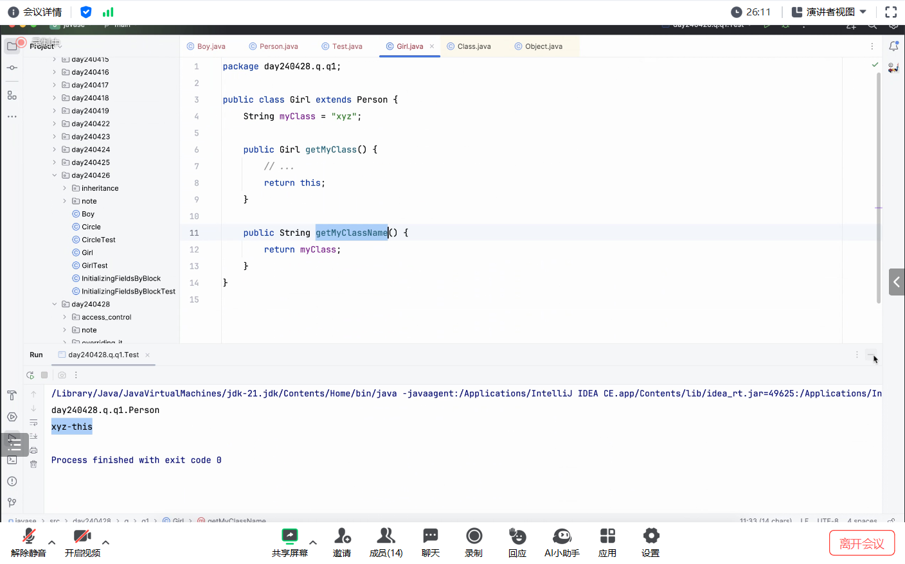
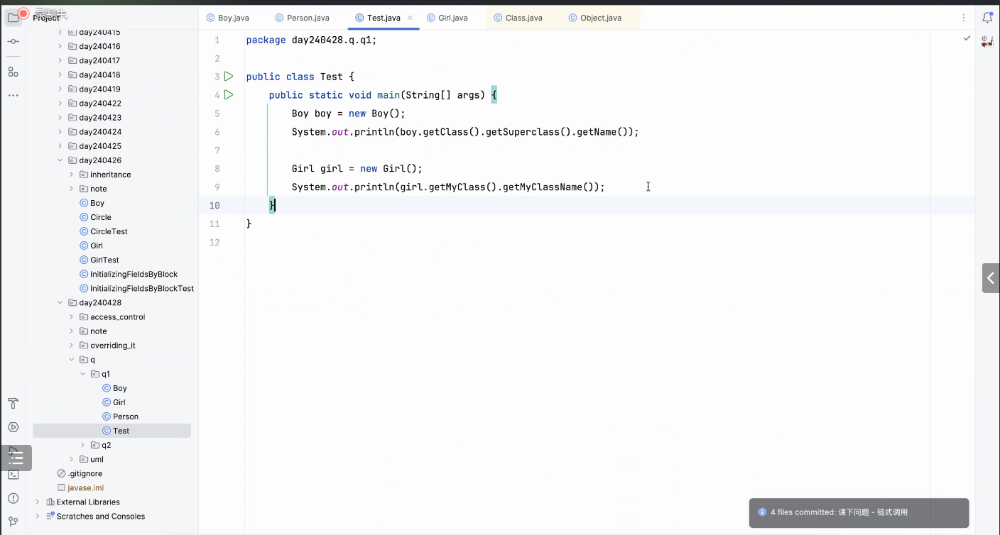
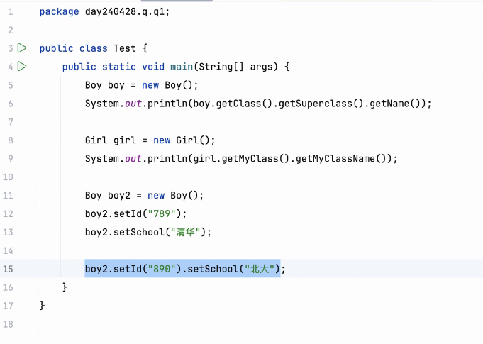
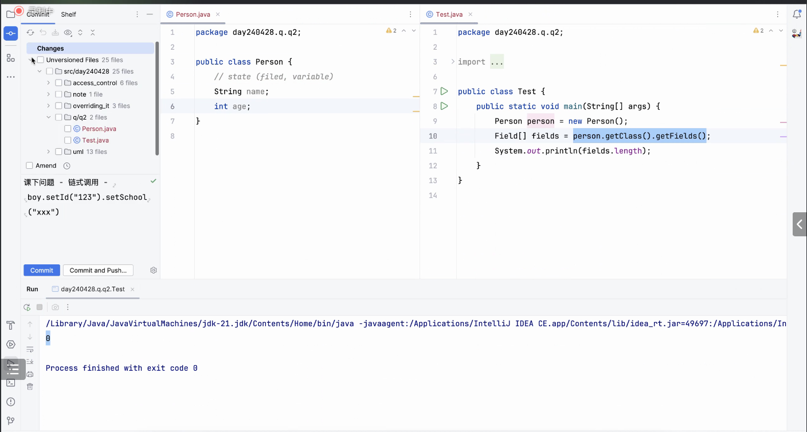
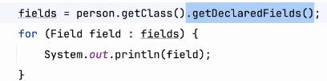
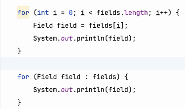
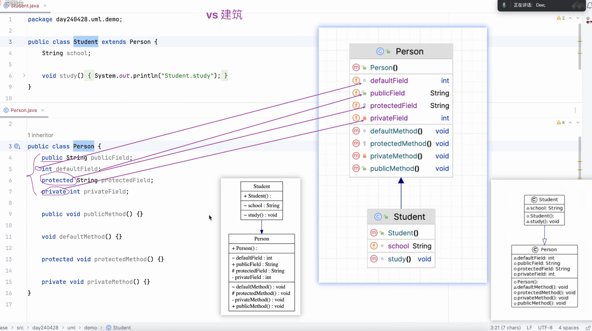
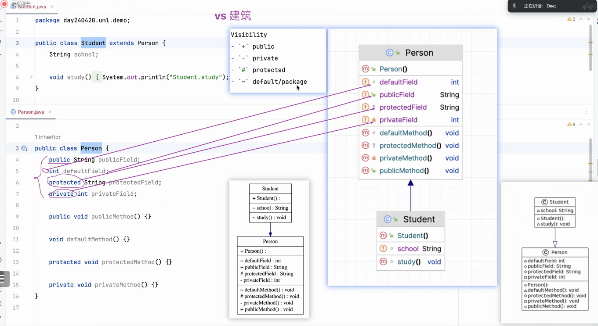

# Note 240428

## Review

## AM

### native 
- 底层是调用类库的代码 (这个代码有可能不是 Java)

### 链式调用
- 
- 
- 返回值可以自己改 从而实现连续set
  - 
- getFields() 只返回 public 的变量 其余的 返回 0
  - 
- getDeclareFields() 可以获取 所有的 访问权限修饰符 的变量
  - 

### 怎么判断是不是同名
- 打印出来就知道了

### foreach
- 

### Unified Modeling Language
- 
- 

## PM

## 技巧 (还是得多注意 细节 ) 
- 从 commit 要写上 关键点 (最好中英文都写) 方便后期查找 
  - 记得今天的 this 
  

## 思维
- 换位思考 也可以用到编程 
  - 引用到别人的类 可以猜一下 如果是你会大概提供什么样的方法
- 类比学习法
  - 通过已有的 , 类比 看看会不会存在同样方式 创造的不一样的 类型
- **清空** 的学习状态
  - 类似于 今天老师提问 并且引出的 super.
  - 碰到陌生的,可以用已知的,用类比的方法,推出有可能的方法,再去验证它
  - 如果会了,可以类比,什么东西跟这个相似,比如说 this 与 super