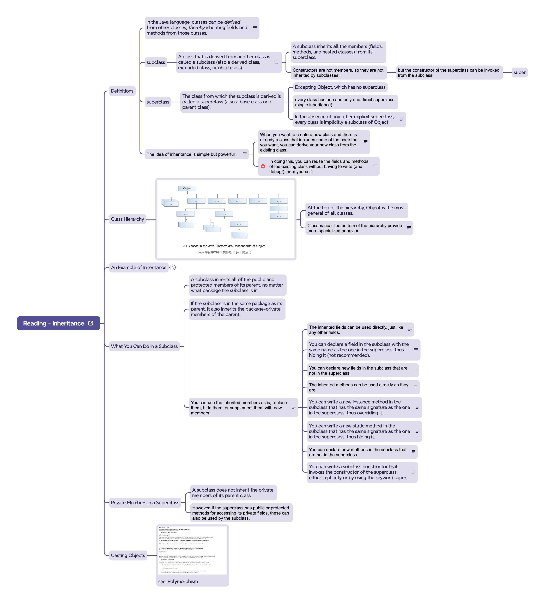
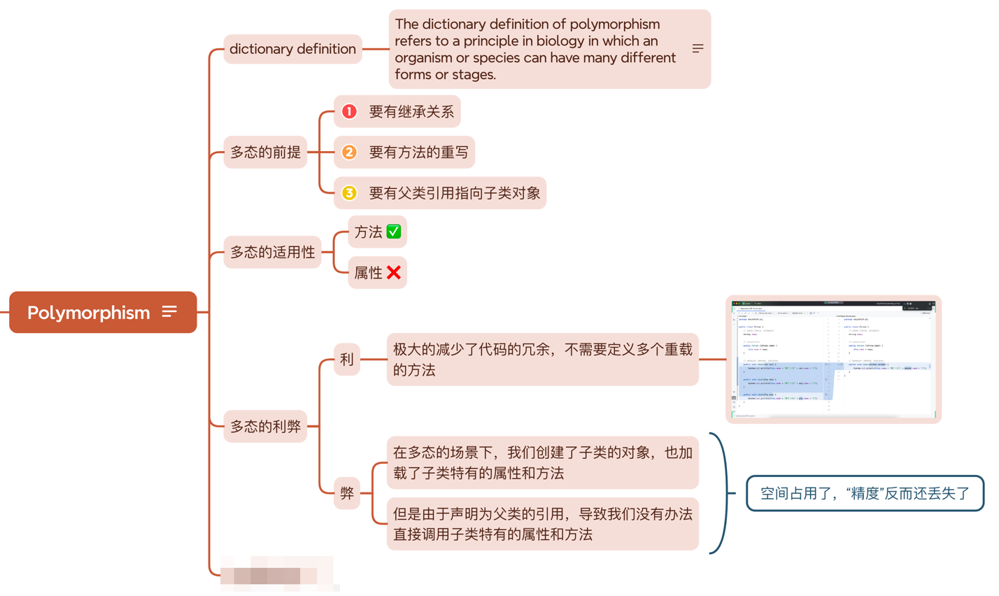
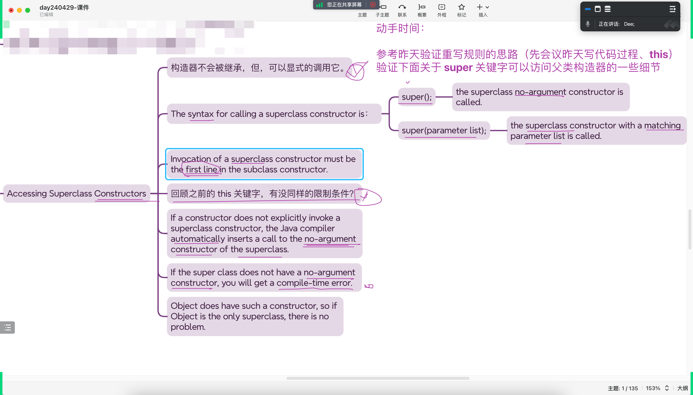

# Note 240429

## Review

## AM
### OOA & D
- 怎么分析?
  - 抽离 主 谓 宾 
  - 现在 mian 里面写出 主 谓 宾 再过去构建 

### 一切 is a Object
- 所有类的父类都是 Object

### subClass 可以 赋值给 superclass
- 子类可以赋值给父类

### Inheritance 继承
- 

## PM

### 多态
- 前提条件
  - 要有 继承
  - 要有 override
-

### 方法的重写 类比成 生物的进化

### super 细节及验证
- 