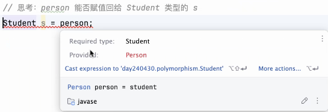
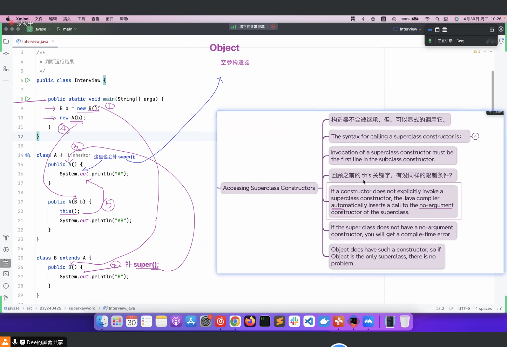
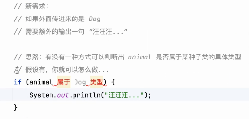
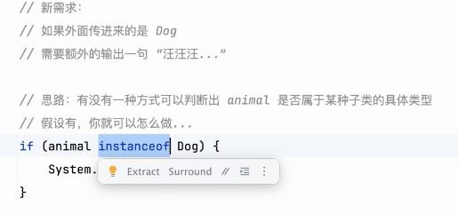

# Note 240430

## Review

## AM

### 一个 .java 文件,可以写多个类,文件里面 public 修饰的类 只有有一个
- 并且 文件名 得是 public 修饰的 类名

### 多态
- 小类型 a = b (b 是 大类型) 转不了 ,但是 可以把 b 强转成 小类型
- 父类 a = b (b 是 子类),反过来也要强转
  - 
  - 兄弟之间不能直接赋值,不能强转
    - 

### instanceof 关键字
- 判断是不是这个对象

### abstract 关键字
- 父类的方法用上 abstract 子类必须 Override

## 练习 
- 

## 方法论
- 锻炼思维
  - 遇到问题
    - 为什么这么问 ( 目的是什么 )
    - 怎么才能提出这样的问题
- 比如:
  - 
  - 
  - 把 思路 写下来
    - 先用 自然语言 写下来 , 再去找有没有这个功能
      - 
      - 