# Note 240507

## Review

### 问题集
- 1
  - 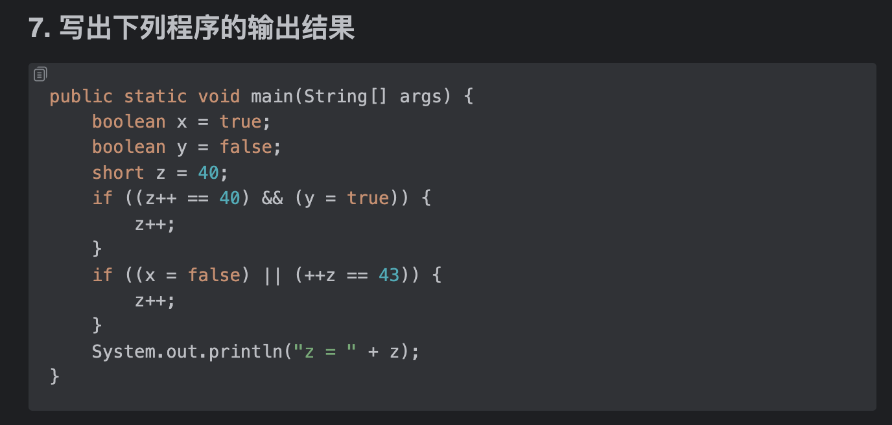
  - 访问修饰符有几种？区别是什么？
- 2
  - 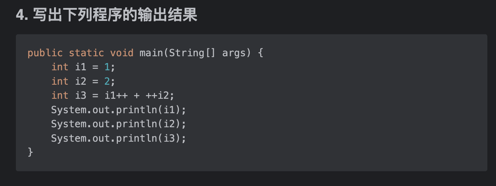
  - 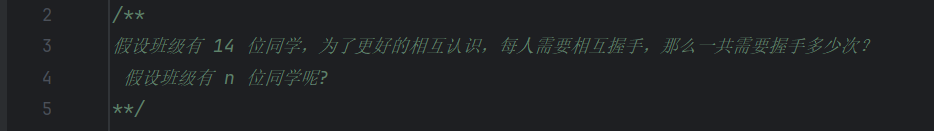
- 3
  - 
  - 
- 4
  - 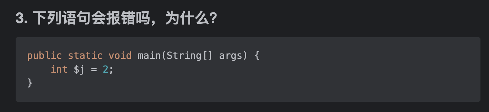
  - Overload 和 Override 之间有什么异同点
- 5
  - 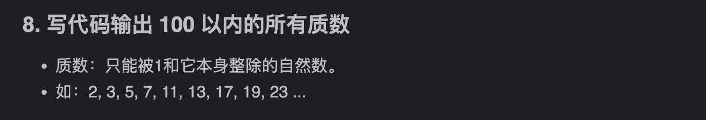
  - 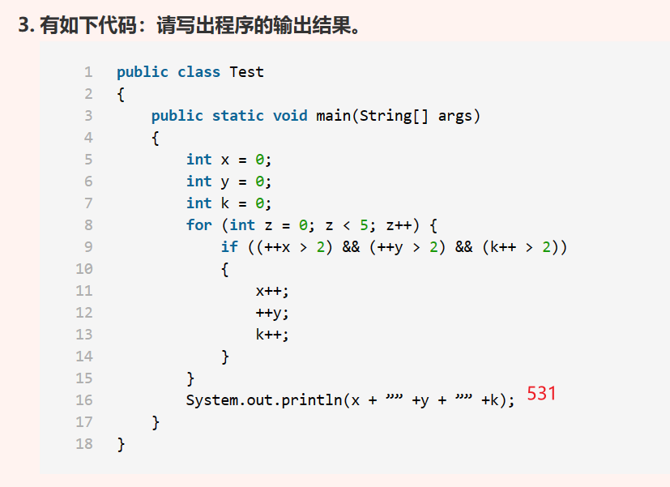
- 6
  - 
  - Java的三大特性是什么?
- 7
  - 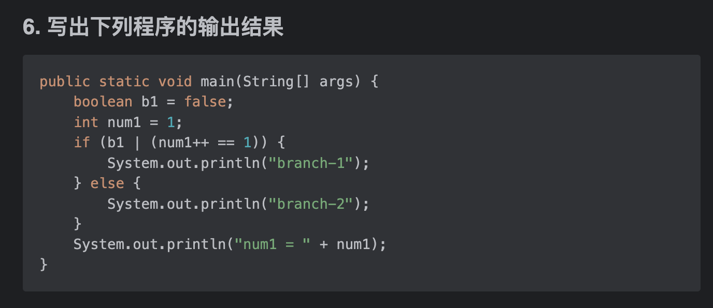
  - 编程的本质是啥?
- 8
  - 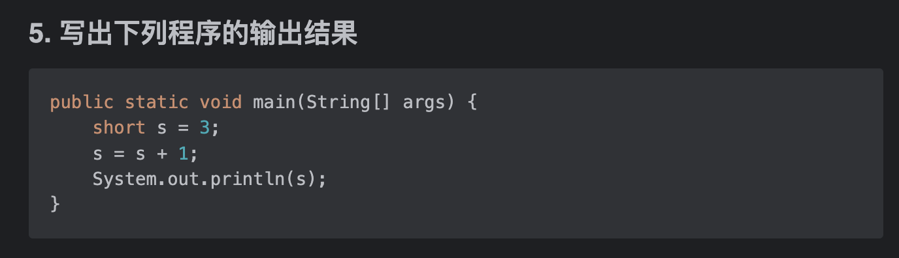
  - 可变长度参数出现的位置?
- 9
  - 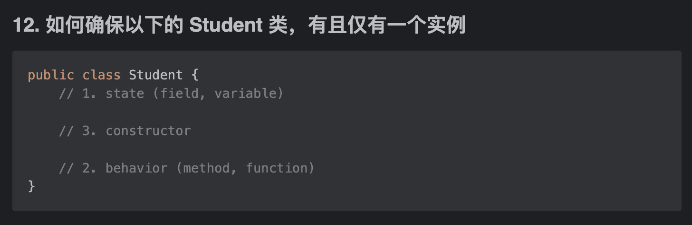
  - java中for循环怎么用
- 10
  - 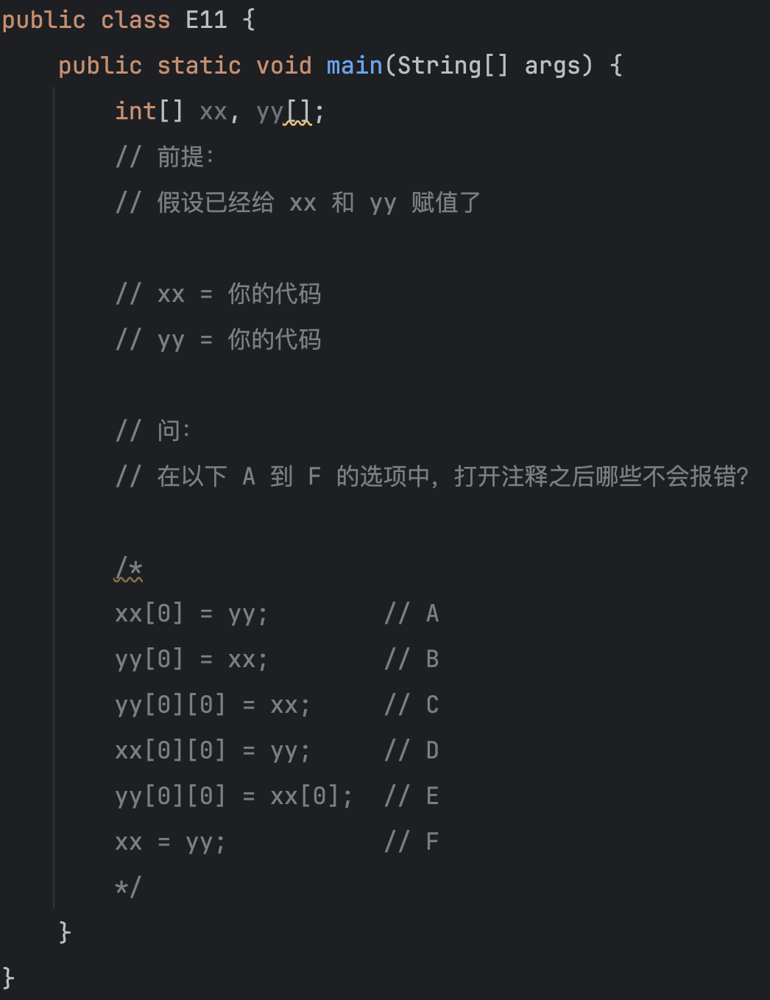
  - 手写出 table99
- 11
  - 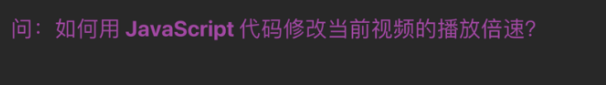
  - 问题：以下代码有几处错误，请全部指出并改正
  - 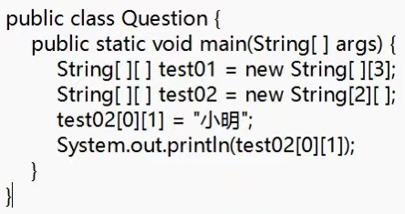
- 12
  - 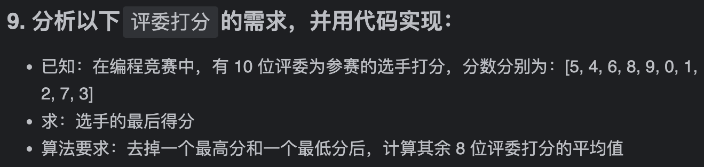
  - 1.pubilc、protected、(default)不写、private修饰符的作用范围？
    2.重载和重写的区别？
- 13
  - 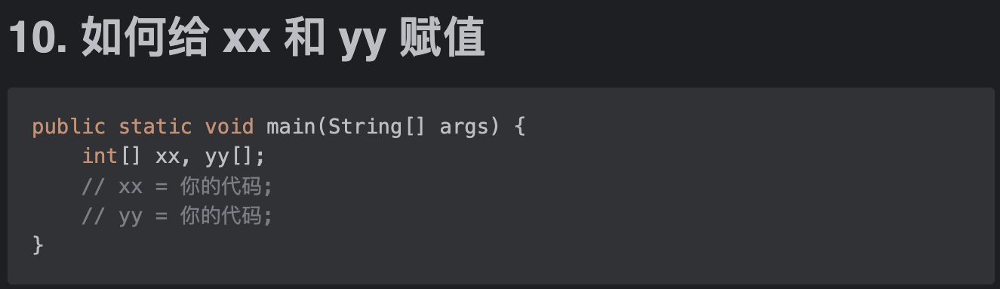
  - this关键字的用法

### 汇报的总结 (在台下的感受)
- 见贤思齐
  - 演讲的形式不一定用 Xmind,如果你的观众里存在非专业人士,怎么吸引注意力?
  - 一些该细记的点有没有细记?
  - 平时的笔记够不够详细,自己认为懂得的,确定懂了?
- 在 "台下" 看录屏中的自己
  - 存在一些口头禅
  - part 和 part 之间的衔接词 是否能用高级点的?

## 思维
- 今天看到这样一句话
  - 读万卷书，行万里路，二者不可偏废 --<<履园丛话>>
  - 思考:
    - 瓶颈的突破是需要 自身具有一定的知识储备和阅历 平时注意积累
    - 无论何时何地请记住 前进缓慢也没关系,请坚持下去.可以回头看,但别忘了向前走
- 就爬 n阶台阶 有多少方法这个问题 进行复盘
  - 为什么想不到用递归?
    - 要不说 一张白纸 好描绘呢?在没学过 % 以及 排列组合 的知识的时候,就会靠思维去解决问题,这里是 白纸 的好处
    - **但是**请不要怀疑知识的重要性,对于像自己这样,有时候思维没法拐弯的状况,依赖知识,一样可以解决问题.所以请**保持学习**
    - 遇到问题就立马用 知识 解决问题这样的思维惯性是不对的,
      - 先宏观,再微观,先想想 能用什么办法解决问题,再选择其中的方法解决问题. 
      - 所以 既要学会通解 也要学会特解.多积累方法,更新自己的方法论
    - 这样的惯性怎么去更改?
      - 将这个意识刻进大脑
      - 然后刻意去练习
      - 二十几年的习惯 更改不是一朝一夕的事 多给点耐心
  