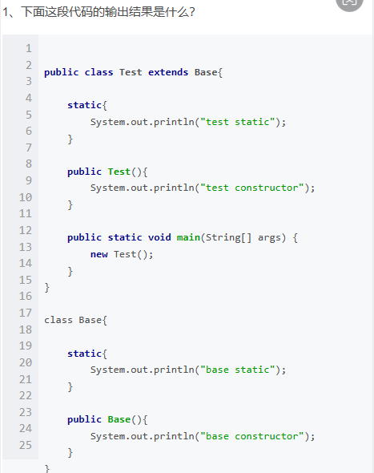

# Note 240507

## Review

### 回顾同学的分享
- 1
  - 
  - 访问修饰符有几种？区别是什么？
- 2
  - 
  - 
- 3
  - 
    /**  
        * 文档注释 在 javadoc 命令下 生成网页
    */
  - 
- 4
  - 
  - Overload 和 Override 之间有什么异同点
- 5
  - 
  - 
- 6
  - 
  - Java的三大特性是什么?
- 7
  - 
  - 编程的本质是啥?
- 8
  - 
  - 可变长度参数出现的位置?
- 9
  - 
  - java中for循环怎么用
- 10
  - 
  - 手写出table99
- 11
  - 
  - 问题：以下代码有几处错误，请全部指出并改正
  - 
- 12
  - 
  - 1.pubilc、protected、(dafault)不写、private修饰符的作用范围？
    2.重载和重写的区别？
- 13
  - 
  - this关键字的用法
