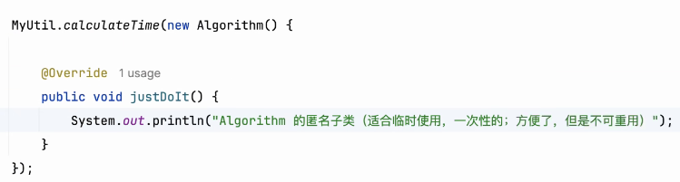
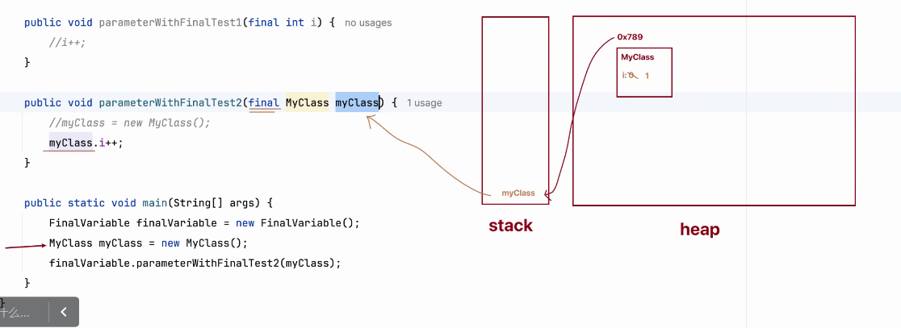
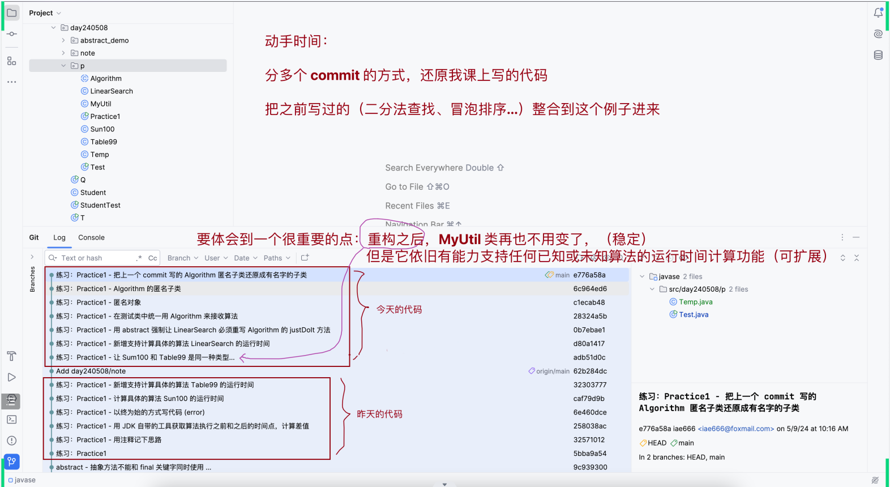

# Note 240509

## Review

## AM

### 匿名对象
- 匿名对象 在参数类型列表中(new Person())

### 匿名子类
- ( new Algorithm() {重写 abstract 方法}) 这里 就是匿名的 抽象方法子类
  - 适合临时使用,一次性的
  - 

### abstract
- 不能修饰变量、代码块、构造器
- 不能修饰 私有方法 , 静态方法 , final 方法 , final 类
 
## PM
### block 执行的时间会比 构造器的更早

### final
- 修饰的类不能被继承
- 修饰的方法不能被重写
- 修饰变量 Instance Variables (Non-Static Fields) 实例变量 必须被初始化
- 修饰变量 Class Variables (Static Fields) 类变量 必须被初始化
- 修饰变量 Local Variables 局部变量 - 值不能被改变
- 修饰变量 Parameters 参数 - 值不能被改变
- final - 修饰变量 Parameters - 值不能被改变 - 引用数据类型
  - 比如:test(final Myclass myclass)
    - 不能改的是 myclass 的地址
    - 

## 思维
- " 求同存异 "
  - 有共同点的东西抽取出来 , 让不同的地方 可以动态的融入进相同的地方
  - 