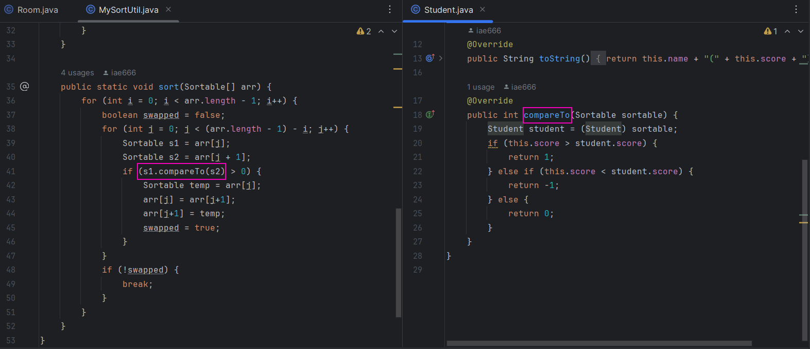

# Note 240510

## Review

## 思维
- 天下事有难易乎?为之,则难者亦易矣;不为,则易者亦难矣
  - 不要有 想太多做的少 的情况
    - ### 做题的思路
      - 做题可以先把需求写进去,边报错边写,让报错的东西提供思路
      - 这样也可以把问题的规模逐渐缩小
- 借用马原那句话 " 矛盾不能化解 , 但是矛盾可以转移 ".
  - 如果 遇到问题 没办法解决 ,看看能不能将问题化解成 另一个问题
    - 如下:
      - 无法确定他会用到什么类型,那可以给别人,我们直接取结果
      - 