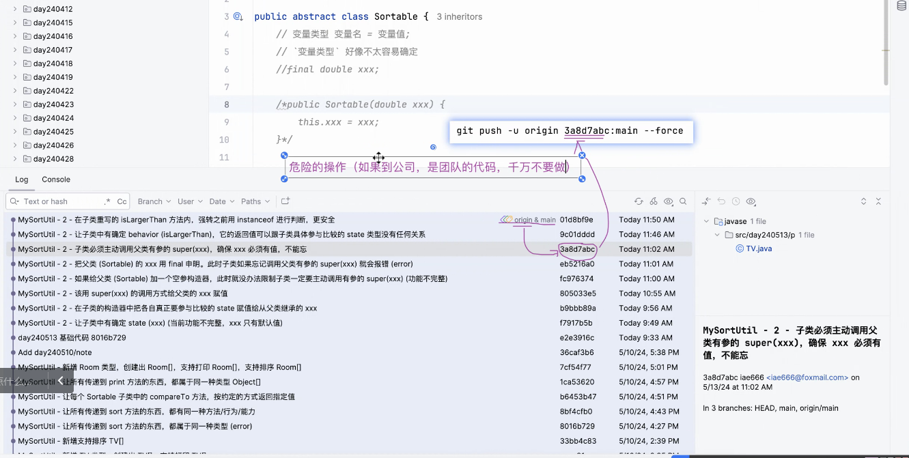
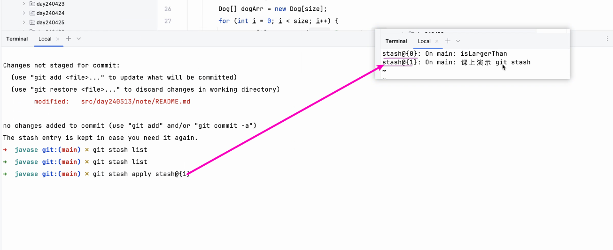
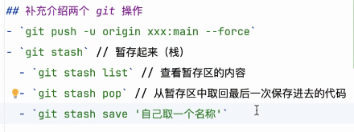

# Note 240513

## Review

## AM

## PM
### 远程代码回到某一时刻
- git push -u origin xxx:main --force
- 

### git 临时保存 commit
- git stash
  - 临时保存 commit
- git stash save '要保存的文件名'
  - 临时保存 commit 并且给个文件值
- git stash list
  - 查看 stash 有没有东西
- git stash pop
  - 出栈 commit
- git stash apply stash{xxx}
  - 取特定的 commit 
  - 
- 

### interface 接口
- 类要实现接口
  - 通过 implements 
- 类实现接口 要重写 接口的方法
- 一个类 可以 实现多个接口
- 接口里面 所有的抽象方法 都可以不用谢 `public abstract`
## 思维
- 可以模糊一样东西,需要的时候再给它一个清晰的定义