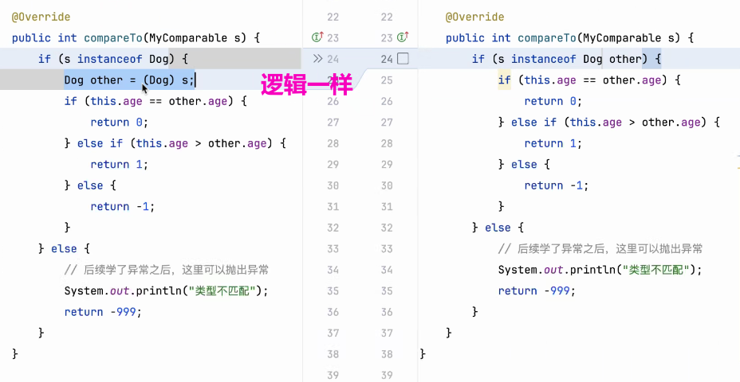
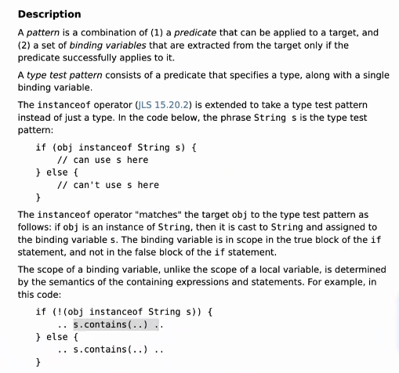
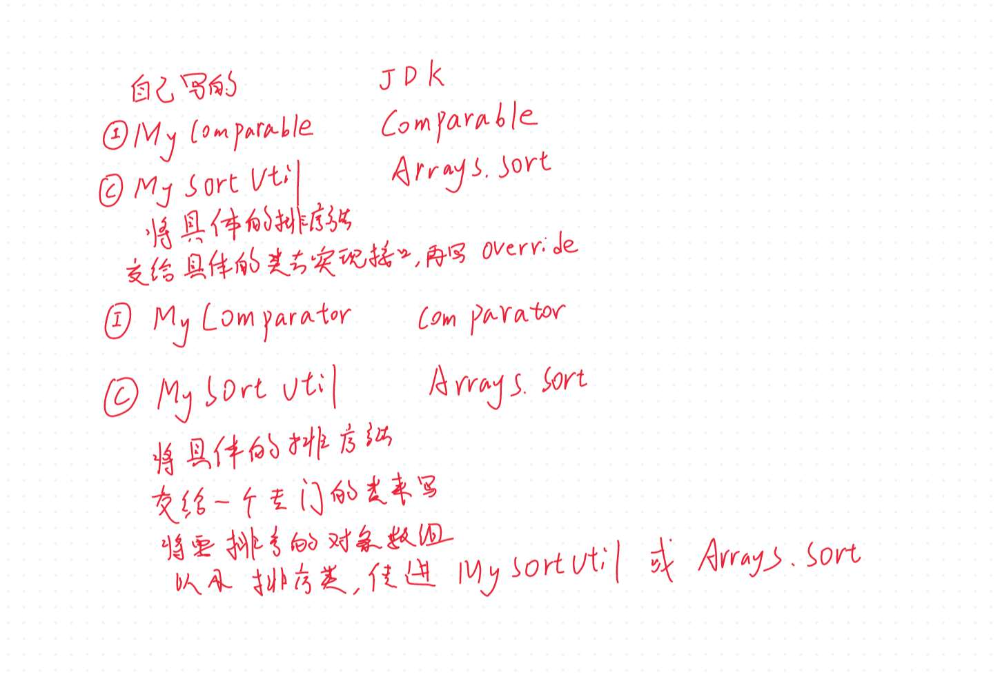

# Note 240514

## Review

## AM

### 简写 
- 
- 

### JDK 新功能查看
- https://openjdk.org/jeps/375

### 想要哪里稳定和可扩展
- 对哪里进行抽象

### MySortUtil 练习的总结
- 

### SOLID 
- ### 是面向对象设计和编程（OOP）中的五大设计原则
    - ### 单一职责原则（Single Responsibility Principle, SRP）：
      - 一个类只负责一项职责。
    - ### 开闭原则（Open-Closed Principle, OCP）：
      - 软件实体应当对扩展开放，对修改关闭。
    - ### 里氏替换原则（Liskov Substitution Principle, LSP）：
      - 子类型必须能够替换掉它们的基类型。
    - ### 接口隔离原则（Interface Segregation Principle, ISP）：
      - 使用多个专门的接口，而不使用单一的总接口，即客户端不应该依赖那些它不需要的接口。
    - ### 依赖倒置原则（Dependency Inversion Principle, DIP）：
      - 一种特定的解耦（通过抽象来引入间接层）形式，使得上层不依赖于下层，使它们都依赖于抽象层。
- 这些原则可以提高程序的可维护性、可读性和可复用性，降低代码之间的耦合程度。

### WIP
- "WIP" 是 "Work In Progress" 的缩写，中文意思是“进行中的工作”或“在制品”。
- 在项目管理和制造业中，"Work In Progress" (WIP) 通常用来描述尚未完成但已开始的工作或任务。这包括所有已经投入生产但还未成为最终产物的资源，也可能是在某个生产阶段停滞下来的部分生产品。对于正在进行的长期项目，或者需要跟踪任务进度，成品比例和剩余工作量的场景，"Work In Progress" 是一个非常重要的概念。