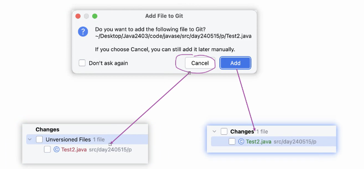
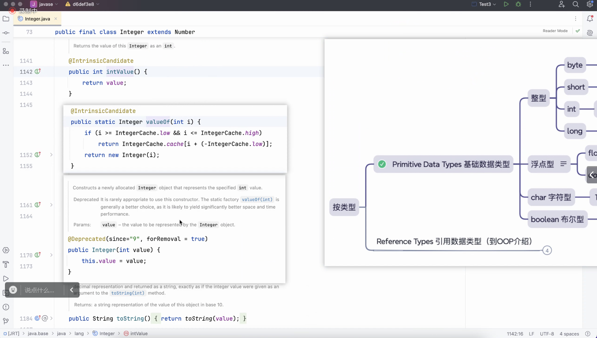

# Note

## Review

## AM

### IDEA 跳出 add file to Git 窗口
- 

### 字符串 + 任何东西都是字符串

### 打印引用数据类型 打印出来的是地址.
- 要打印出值,那就重写 toString() 

### 包装类
- ### Byte
- ### Short
- ### Integer
  - int 对应的`包装类`
  - int 会自动转成 Integer (自动装箱 就是自动 new Integer(1))
    - 
    - 
    - 
- ### Long
- ### Float
- ### Double
- ### Character
- ### Boolean

### String
- 为什么 String 不用 new
  - 自动 new 了 
    - 

### 注解
- @Deprecated
- 在 Java 中，@Deprecated 是一个标记注解，用于指示某个程序元素（类，方法等）已经过时。这是一种提示给其他开发人员的信息，表示这个元素不再被推荐使用，可能在将来的版本中被删除或者不再维护。
  - 

### 包装类的拆箱与装箱
- int ( 总结 )
  - 