# Note 240520
## Review

## AM
### 包装类
- Link
  - https://docs.oracle.com/javase/tutorial/java/data/numberclasses.html
- 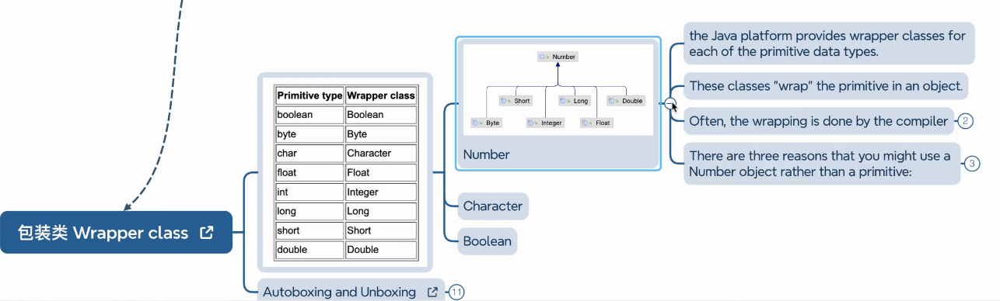
  - 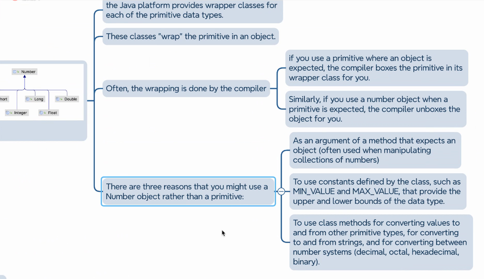
    - 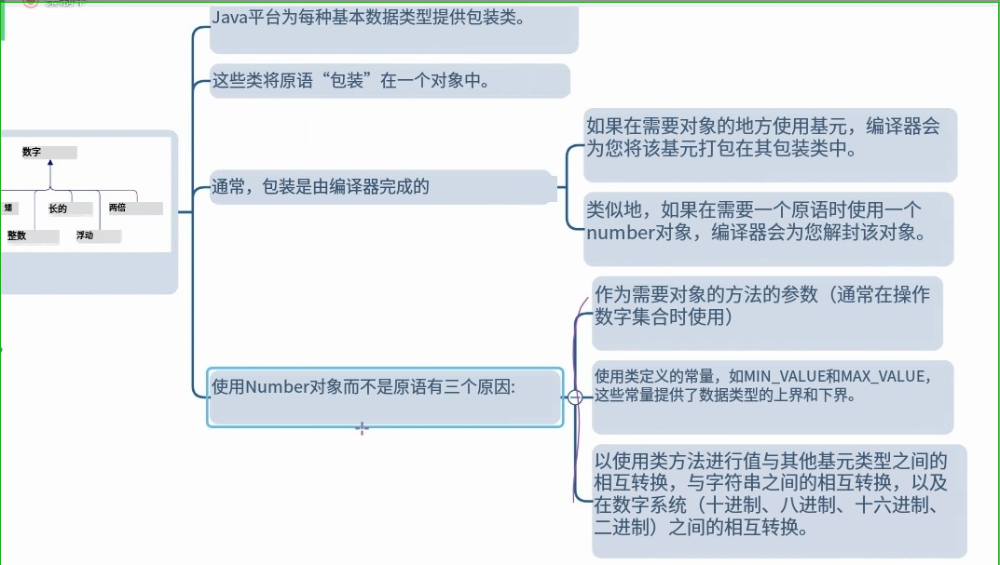
  - 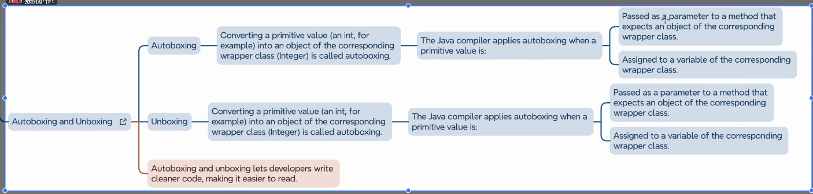
    - 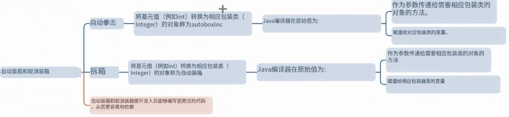
### interface 接口
- 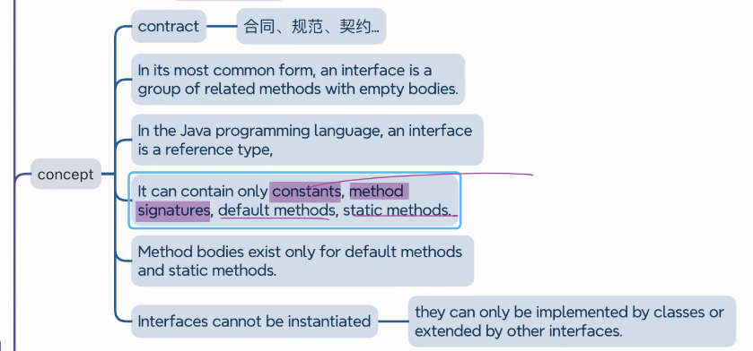
  - 
- 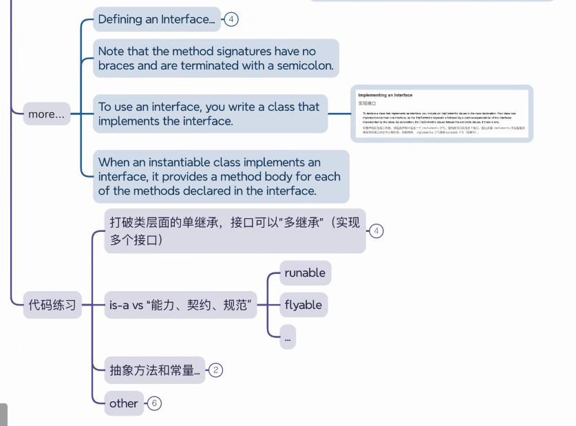
- 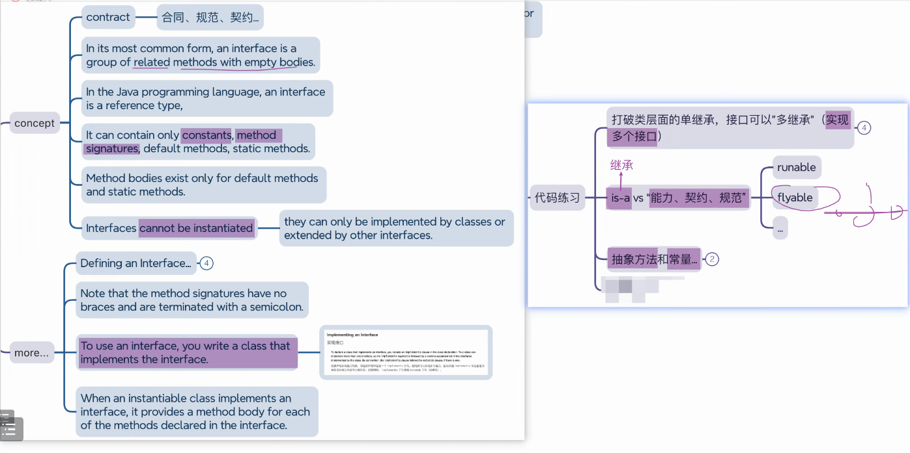
  - 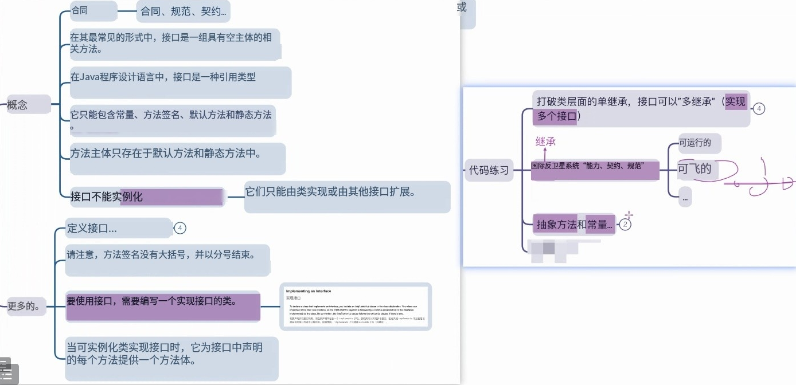
- 接口里的 变量 和 方法 
  - 接口里的 变量 是 public static final
  - 接口里的 方法 是 public abstract
  - 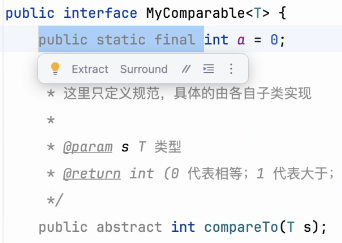

### 代码 ( WhyUseGenerics ) 用图
- 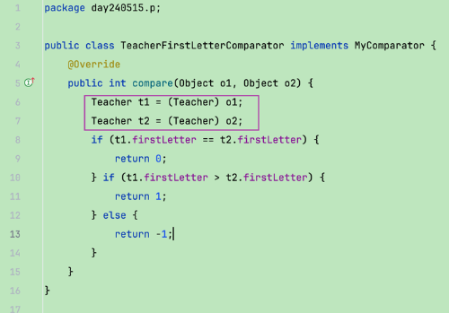
- 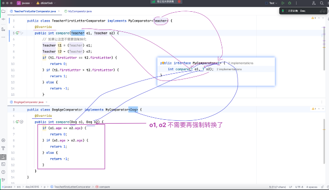
- 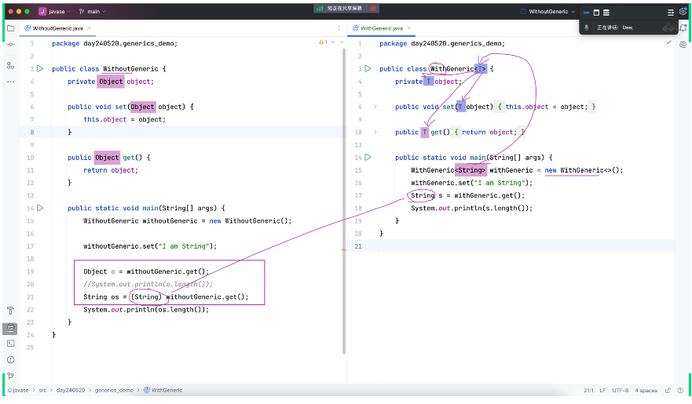