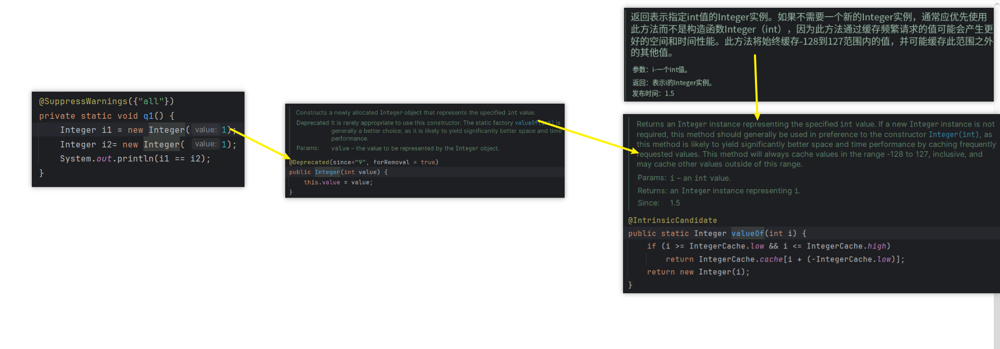

# Note 240521
## Review

## AM
### 包装类面试题
- 
  - 
  - 
### 接口 Interface 面试题
- 
- 
## PM
### 泛型
- 显式指定类型 gm.<String>m1("string");
  - 
- 显式指定类型 Integer i = gm.<Integer>m1(89);
  - 
- 类型参数不能为基本类型
  - 
- 题目
  - 
- ### 通配符
- 上限
  - 
  - 以 A 顶部 为上限
- 下限
  - 
  - 以 B 底部 为下限
- 