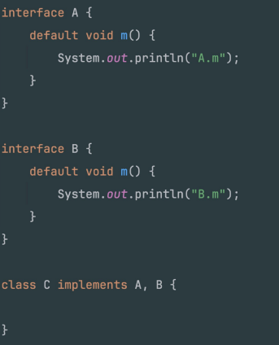
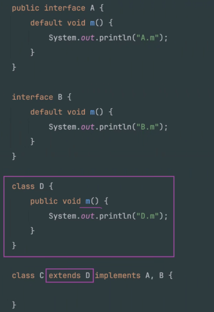
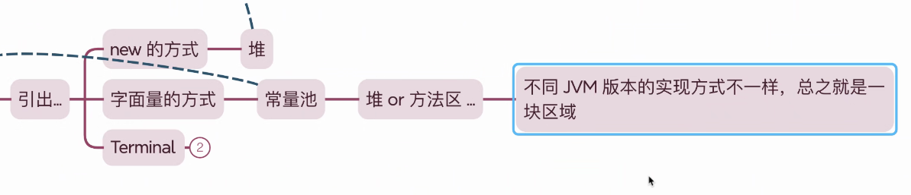
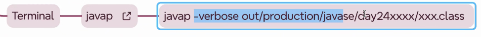
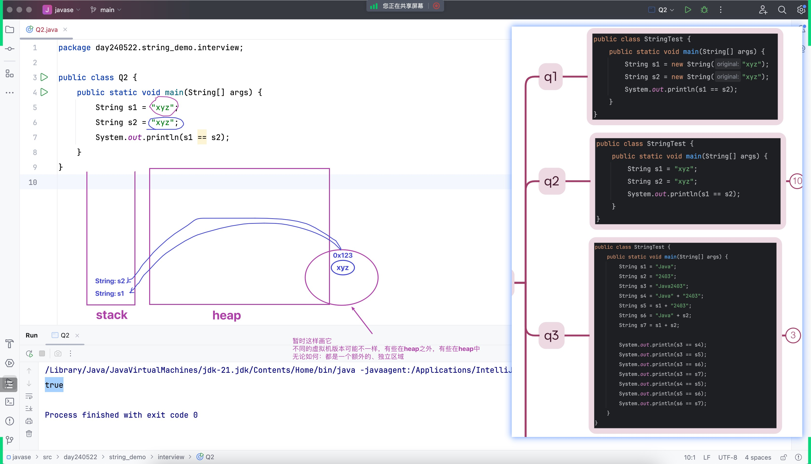
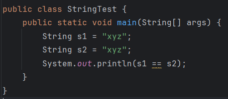
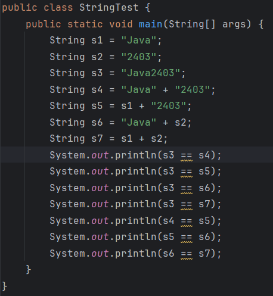
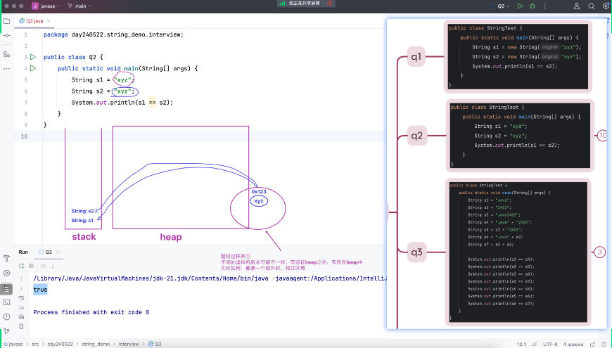

# Note 240522
## Review

## AM
### interface
- JDK8之前，接口就是抽象方法和常量的合集
- 打破"类层面的单继承。一个类可以继承另一个类，同时可以实现接口，实现多个接口
- 接口可以继承多个接口
- default methods , static Methods 
  - 有方法体,并且可以不用被 实现类 Override
  - 两个 default Method 不能有 相同的 方法名 , 如果要相同 实现类 要 Override 
  - static method 要用 接口名.方法()
- 面试题 interview
  - 
  - interview 2
    - 

### String
- 
  - 
  - javap -verbose out/production/...
- 字面量赋值 (不是 new 出来的)
  - 常量池
    - 
- 面试题 interview
  - 1
    - 
    - 这段代码中的 s1 == s2 结果为 "true" 是因为 "xyz" 是一个字符串字面量。在 Java 中，所有的字符串字面量都是在同一个内存区域中进行存储的，这个区域被称为字符串常量池（String Constant Pool）。
    - 当创建 s1 时，"xyz" 这个字符串在常量池中被创建并且 s1 引用了这个字符串。然后在创建 s2 时，Java 首先检查字符串常量池中是否已经存在 "xyz" 这个字符串。由于 s1 已经创建过，所以 s2 直接引用了同一个字符串，而不是创建新的。因此，s1 和 s2 引用的是内存中的同一个对象，s1 == s2 返回 "true"。
  - 2 
    - 
      - System.out.println(s3 == s4); 应该会输出 "true"，而 System.out.println(s3 == s5); 应该会输出 "false"。
        - 解释如下：
          - 对于表达式 s3 == s4，因为 "Java" 和 "2403" 都是字符串常量，所以在编译期间，编译器就可以确定它们的值并进行优化，这行代码实际上相当于 String s4 = "Java2403";。所以 s3 和 s4 都指向同一个字符串对象（在字符串常量池中），因此 s3 == s4 成立。
          - 但是对于 System.out.println(s3 == s5);，表达式 s1 + "2403" 是在运行时才能确定的，因为 s1 是一个变量，即使它的值是一个字符串常量 "Java"，编译器也不会对它进行优化。因此 s1 + "2403" 会创建一个新的字符串对象，所以 s3 == s5 会返回 "false"。

### (teacher) 
- 