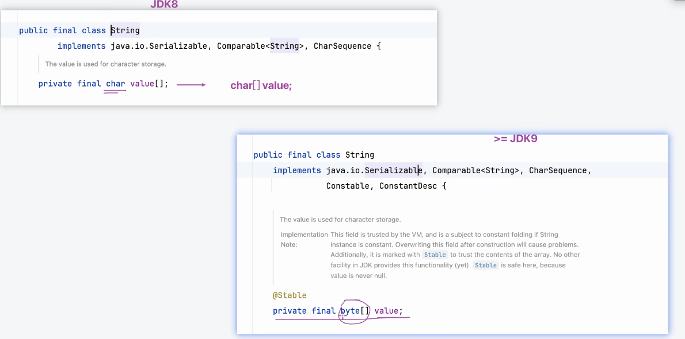

# Note 240523
## Review

## AM
### 三种 字符拼接的方法
- ### `+`
  - 版本升级( 链接 ) https://openjdk.org/jeps/254
    - 
- ### `StringBuffer`
- ### `StringBuilder`
- 单线程:
  - StringBuilder 更快
- 多线程:
  - StringBuffer 可能会更快 因为做了多线程的校验 (所以单线程的时候会慢一些)
