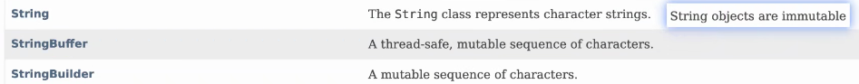
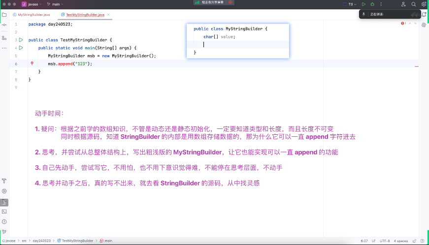

# Note 240523
## Review

## AM
### 三种 字符拼接的方法
- ### `+`
  - final 修饰的
    - 版本升级( 链接 ) https://openjdk.org/jeps/254
      - 
      - 
- ### `StringBuffer`
- ### `StringBuilder`
- 单线程:
  - StringBuilder 更快
- 多线程:
  - StringBuffer 可能会更快 因为做了多线程的校验 (所以单线程的时候会慢一些)
### 思考 
- StringBuilder 的内部是用数组存数据的 为什么 可以 一直 append 字符进去?
- 

### String 官网
- https://docs.oracle.com/en/java/javase/21/docs/api/java.base/java/lang/String.html#method-summary