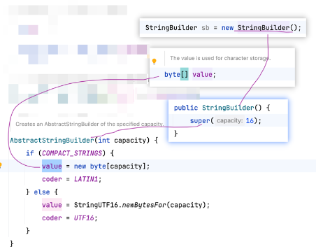
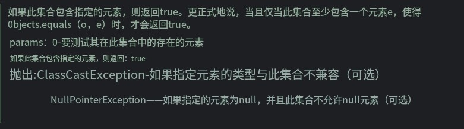
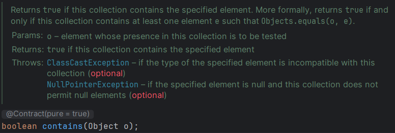

# Note 240524
## Review

## AM
### StringBuilder
- 源码
  - 
### 集合
- 
- ### ArrayList
  - ### 源码
    - 
  - ### Questions
    - ArrayList 的底层用什么存储的?
      - Object[]
      - 
    - 初始数组长度是多少?
      - 如果 new() ,是 0 ; 如果 不是调用空参构造器 是 10
      - 
    - 可以自己指定吗?怎么指定?
      - 通过 构造器 public ArrayList(Collection<? extends E> c) 
        - 
        - 
    - add 的时候超过数组长度，它是怎么处理的?
      - 
- ### Collection
  - ### 常用方法
    - contains() 
      - Returns true if this collection contains the specified element. More formally, returns true if and only if this collection contains at least one element e such that Objects.equals(o, e).
      - 如果此集合包含指定的元素，则返回true。更正式地说，当且仅当此集合包含至少一个元素(如Objects)时返回true。= (o, e)。
      - 
      - 
      - 此方法 底层 调用了equal()
        - 为什么 strings.contains 与 students.equal() 不一样
        - 因为 String Override (重写) equal() 方法 如果 students 也要实现类似的效果, Student 类 Override 重写 equal()
    - remove()
      - Removes the first occurrence of the specified element from this list, if it is present. If the list does not contain the element, it is unchanged. More formally, removes the element with the lowest index i such that Objects.equals(o, get(i)) (if such an element exists). Returns true if this list contained the specified element (or equivalently, if this list changed as a result of the call)
      - 从此列表中删除第一个出现的指定元素(如果该元素存在)。如果列表中不包含该元素，则该元素不变。更正式地说，删除具有最低索引i的元素，例如Objects。= (0, get(i))(如果存在这样的元素)。如果此列表包含指定的元素(或者等价地，如果此列表因调用而更改)，则返回true。
      - 从列表删除元素
      - 有两个重载的方法 remove(int) 、remove(Object)
    - set()
      - Replaces the element at the specified position in this list with the specified element.
      - 将此列表中指定位置的元素替换为指定元素。
      - Replaces the element at the specified position in this list with the specified element.
      - 将此列表中指定位置的元素替换为指定元素。
### 在线查看 JDk API
- https://docs.oracle.com/en/java/javase/21/docs/api/index.html

### 迭代器 Iterator
- iterator.hasNext() 
  - 是否有下一个元素
- iterator.next()
  - 返回下一个元素