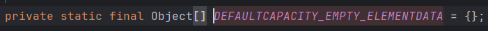
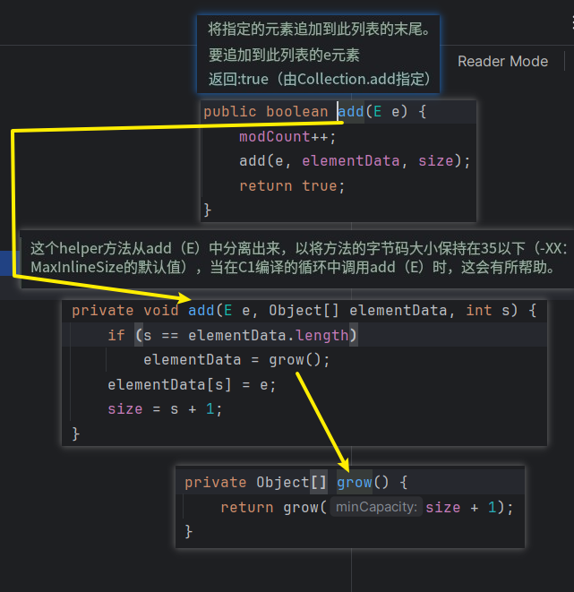

# Note 240524
## Review

## AM
### 集合
- 
- ### ArrayList
  - ### 源码
    - 
  - ### Questions
    - ArrayList 的底层用什么存储的?
      - Object[]
      - 
    - 初始数组长度是多少?
      - 0
      - 
    - 可以自己指定吗?怎么指定?
      - 通过 构造器 public ArrayList(Collection<? extends E> c) 
        - 
        - 
    - add 的时候超过数组长度，它是怎么处理的?
      - 