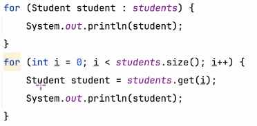
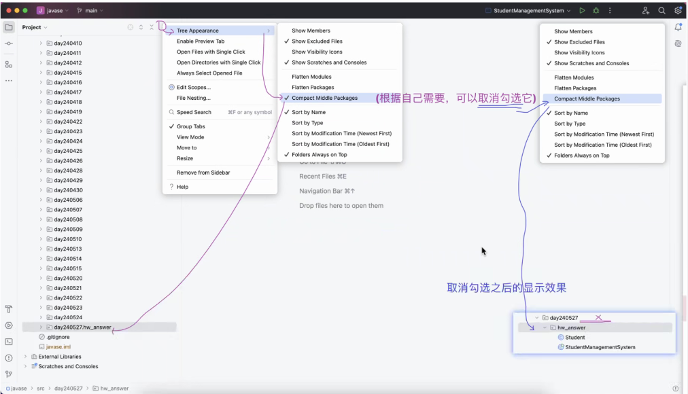
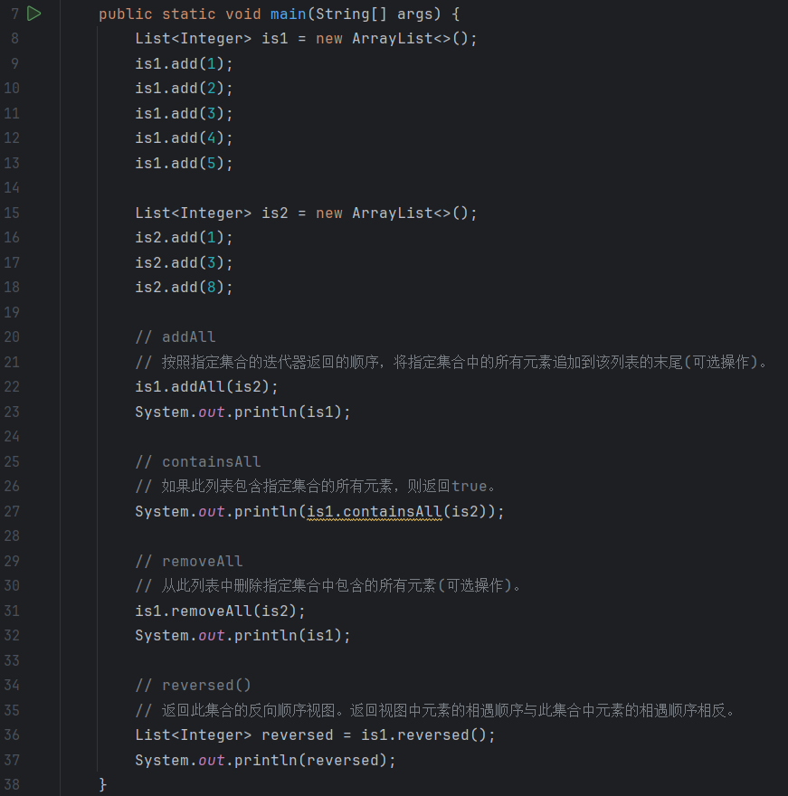
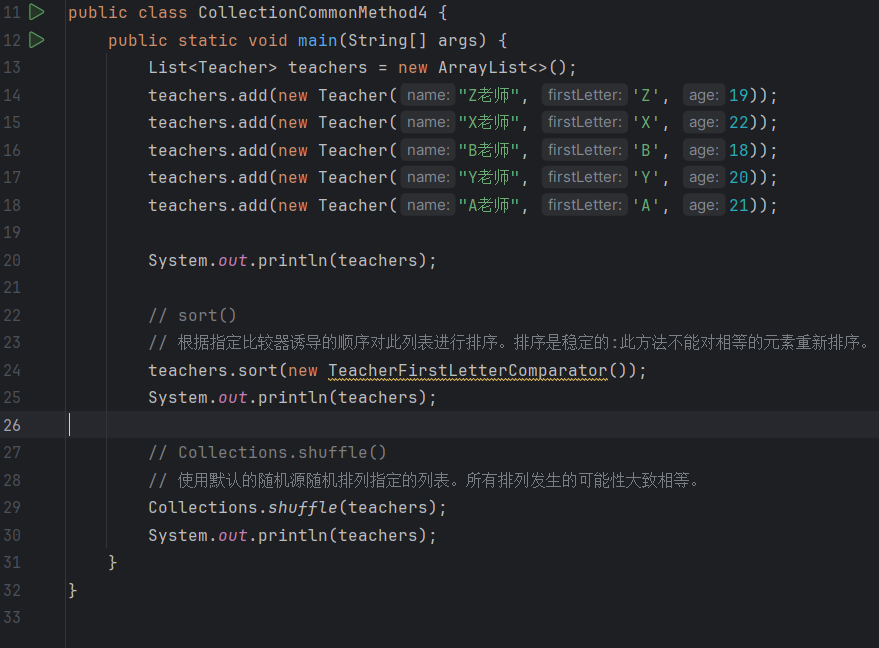
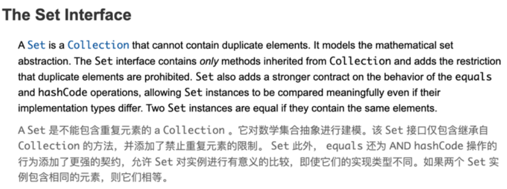
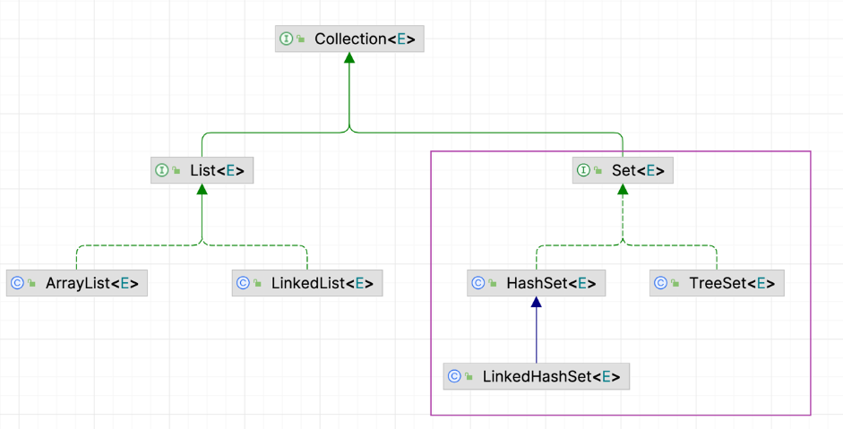
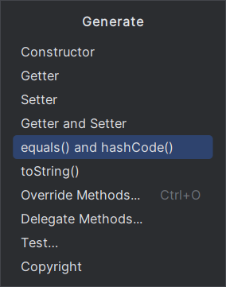
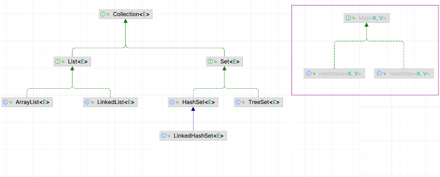

# Note 240527
## Review

## AM
### 查看 API 的能力很重要

### 增强 for 循环
- 

### IDEA 文件夹 设置 ( 文件夹的路径就不会压缩 )
- 

### Java 中带 名字带 s 的一般是工具类

### Collections 工具类
- Collections.shuffle()
  - 乱序 "洗牌"

### The List Interface
- A List is an ordered Collection(sometimes called a sequence).
  - 列表是有序的集合(有时称为序列)
- Lists may contain duplicate elements.
  - 列表可能包含重复的元素。
- more reading https://docs.oracle.com/javase/tutorial/collections/interfaces/list.html

### Collection
- addAll
  - 按照指定集合的迭代器返回的顺序，将指定集合中的所有元素追加到该列表的末尾(可选操作)。
- containsAll
  - 如果此列表包含指定集合的所有元素，则返回true。
- removeAll
  - 从此列表中删除指定集合中包含的所有元素(可选操作)。
- reversed()
  - 返回此集合的反向顺序视图。返回视图中元素的相遇顺序与此集合中元素的相遇顺序相反。
- sort()
  - 根据指定比较器诱导的顺序对此列表进行排序。排序是稳定的:此方法不能对相等的元素重新排序。
- ### Collections 工具类
  - Collections.shuffle()
    - 使用默认的随机源随机排列指定的列表。所有排列发生的可能性大致相等。
- 代码截图
  - 
  - 

## The Set Interface
- A Set is a Collection that cannot contain duplicate elements.
  - Set是不能包含重复元素的Collection。
- It models the mathematical set abstraction.
  - 它对数学集合抽象进行建模。
- The Set interface contains only methods inherited from Collection
  - Set 接口只包含从 Collection 继承的方法
- and adds the restriction that duplicate elements are prohibited.
  - 并增加了禁止重复元素的限制。
- Set also adds a stronger contract on the behavior of the equals and hashCode operations, allowing Set instances to be compared meaningfully even if their implementation types differ.
  - Set 还为 equals 和 hashCode 操作的行为添加了更强的契约，允许对 Set 实例进行有意义的比较，即使它们的实现类型不同。
- Two Set instances are equal if they contain the same elements.
  - 如果两个 Set 实例包含相同的元素，则它们是相等的。
- set 是无序的
- 
- ### Set 在整个 Collection 架构下的大体位置
  - 

### Set 是如何判断元素是否重复的
- 只重写 equals 方法还是无法判断 是否重复
- 为什么右击 -> Generate 的时候看到两个方法写一起的选项
  - 
- 为了提高效率，避免元素多了之后的大量 equals 对比，引出了 hashCode 判断机制
- 先判断两元素的 hashCode 是否相等
  - 如果不等，当成不同元素，以提高性能
  - 如果相等，再调用 equals 进一步验证
- 所以：以后但凡重写了 equals 或 hashCode 其中一个方法，另一个也一起重写，并保持逻辑一致
- 无序 : 非按索引，而是 hash 值。底层 HashMap（数组 + 链表）不同 JDK 版本也有差异（>=JDK8 数组 + 链表 + 红黑树）

### LinkedHashSet
- 适合频繁遍历的场景，遍历顺序按添加的顺序输出
- 但它并非`有序`，底层还是`无序`的，遍历的有序只是因为使用链表结构，额外记录了上一个下一个元素的位置而已，并没有打破 `Set` 的本质特性

### TreeSet
- All elements inserted into the set must implement the Comparable interface.
- all such elements must be mutually comparable: e1.compareTo(e2) ...
  must not throw a ClassCastException for any elements e1 and e2 in the set.
  简单理解：必须是同一种类型

## The Map Interface
- A Map is an object that maps keys to values.
  - Map 是一个将键映射到值的对象。
- A map cannot contain duplicate keys: Each key can map to at most one value.
  - 一个映射不能包含重复的键:每个键最多只能映射到一个值。
- It models the mathematical function abstraction.
  - 它对数学函数抽象进行建模。
- The Map interface includes methods for basic operations
  - Map 接口包括用于基本操作的方法
    - (such as put, get, remove, containsKey, containsValue, size, and empty),
      - (例如 put, get, remove, containsKey, containsValue, size，和empty)，
    - bulk operations (such as putAll and clear),
      - 批量操作(如putAll和clear);
    - and collection views (such as keySet, entrySet, and values).
      - 和集合视图(如 keySet 、 entrySet 和 values )。
- The Java platform contains three general-purpose Map implementations: HashMap, TreeMap, and LinkedHashMap.
  - Java 平台包含三种通用的 Map 实现: HashMap 、 TreeMap 和 LinkedHashMap 。
- Their behavior and performance are precisely analogous to HashSet, TreeSet, and LinkedHashSet, as described in The Set Interface section.
  - 它们的行为和性能与 HashSet 、 TreeSet 和 LinkedHashSet 非常相似，如 Set Interface 一节所述。
- read more https://docs.oracle.com/javase/tutorial/collections/interfaces/map.html

### Map 跟 Collection 在顶层上是独立的，没有继承/实现关系
- 