# Note 240528
## Review

### 多光标 Mutiple cursor
- 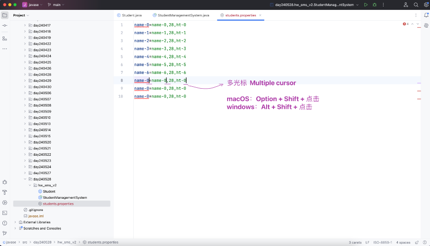

### HW - SMS - v2
- 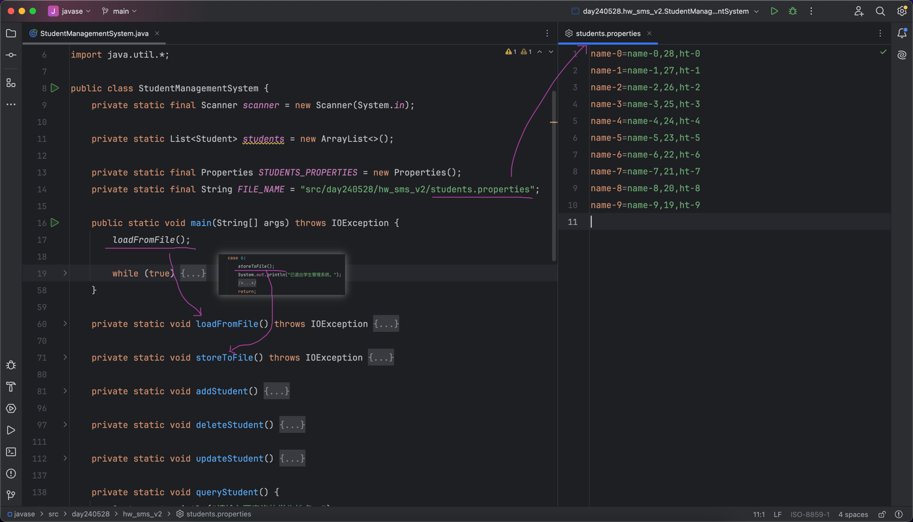

## Exceptions
### What Is an Exception?
- The term exception is shorthand for the phrase "exceptional event."
  - 术语“异常”是“异常事件”的缩写。
- > Definition: An exception is an event, which occurs during the execution of a program, that disrupts the normal flow of the program's instructions.
  - 定义:异常是在程序执行过程中发生的事件，它破坏了程序指令的正常流程。
- When an error occurs within a method, the method creates an object and hands it off to the runtime system.
  - 当在方法中发生错误时，该方法创建一个对象并将其传递给运行时系统。
- The object, called an exception object, contains information about the error, including its type and the state of the program when the error occurred.
  - 该对象称为异常对象，包含有关错误的信息，包括错误类型和错误发生时程序的状态。
- Creating an exception object and handing it to the runtime system is called throwing an exception.
  - 创建异常对象并将其交给运行时系统称为抛出异常。
- 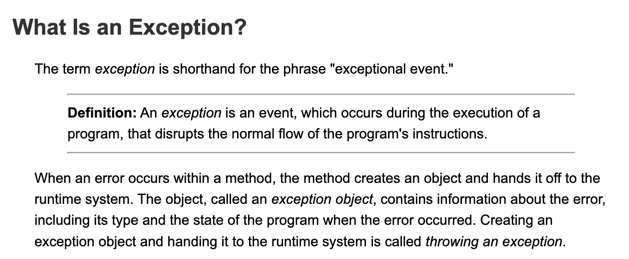
- 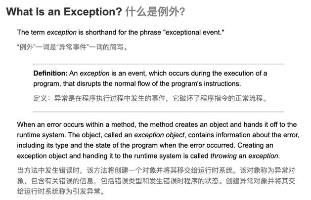

### 编译时异常 vs 运行时异常
- checked exception 编译时异常 vs 运行时异常 unchecked exception (RuntimeException)
- 待补充 UML 类图

### 异常的处理
- 你没能力，接着往上抛
  - throws XxxException ...
- 有能力，自己处理
  - try-catch-finally

### 异常
- 整体架构图
- 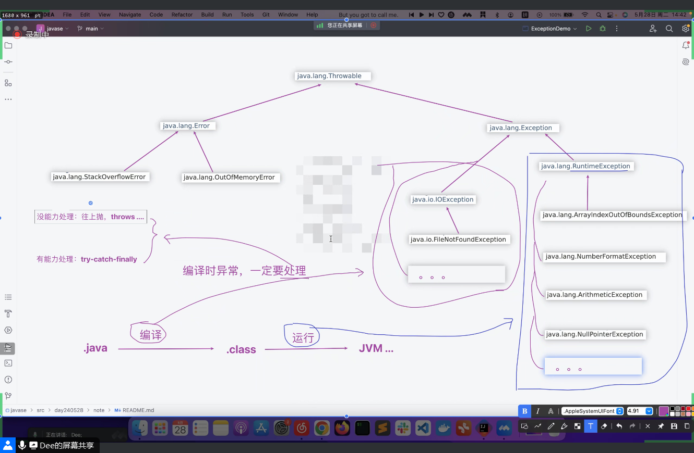
- 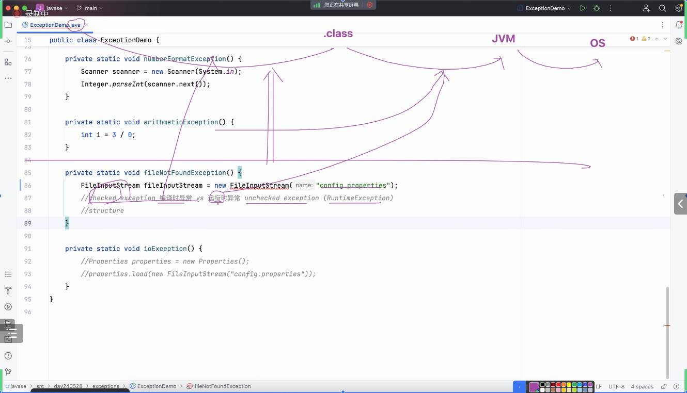
- 处理 得处理好 不然会出事故  
- e.getMessage();
- e.printStackTrace();
- try - catch - finally
  - 无论如何都会执行到代码 哪怕出现了异常
  - 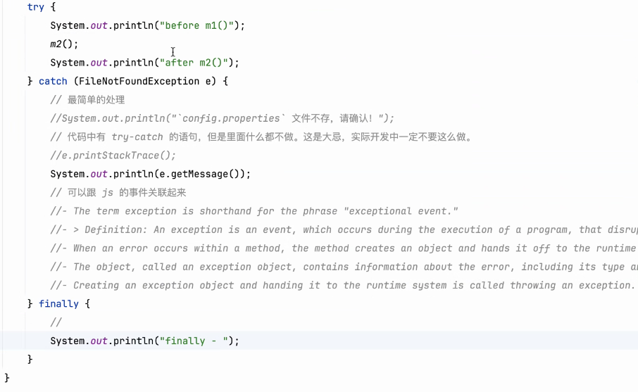

### 先解决之前留下的 // todo 记号
- 
- 验证在方法声明中增加了抛异常的语句 `throws ...` 对 `Overload` 和 `Override` 的影响
  - Overload
  - Override
- 验证完之后，把 `// todo` 删除掉

## 截图寄存处
- 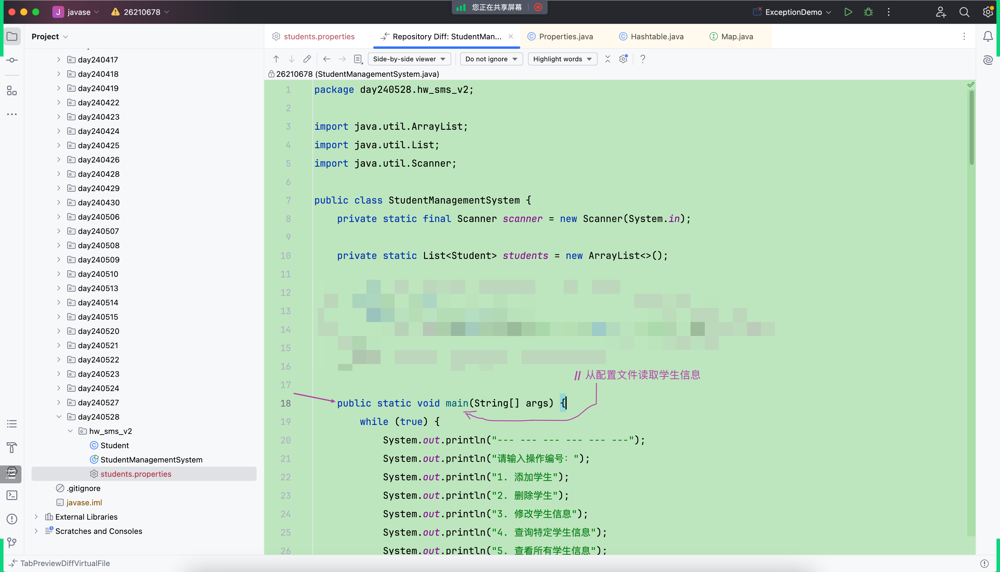
- 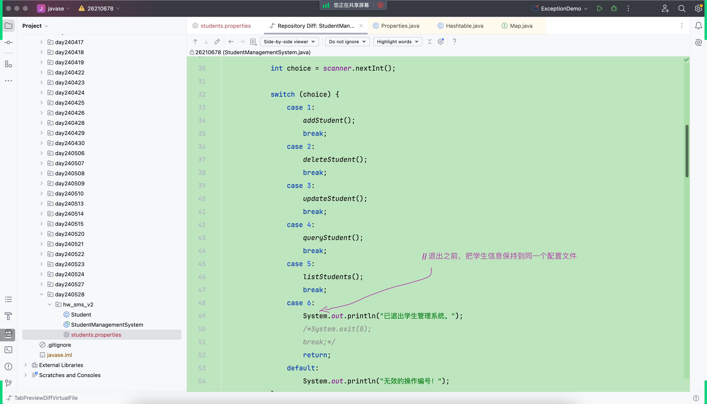
- 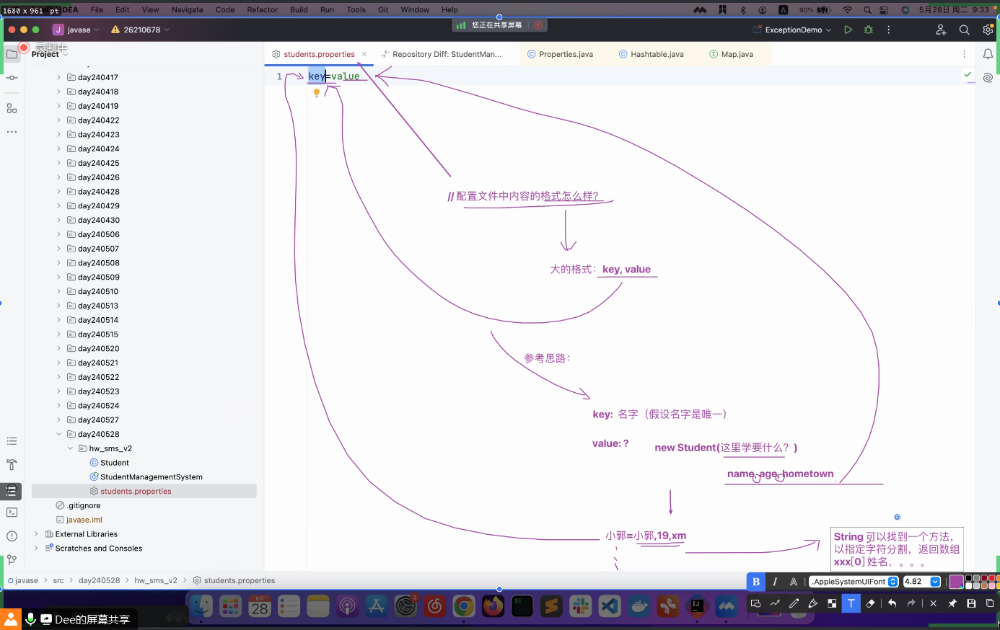
- 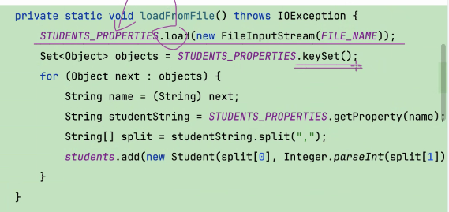
- 
- 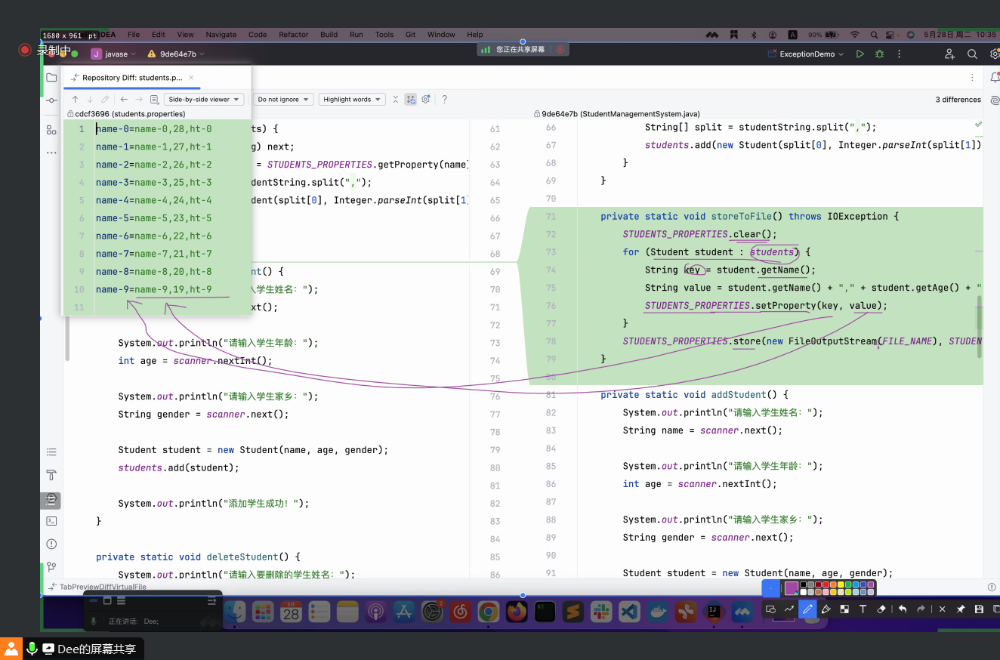
- 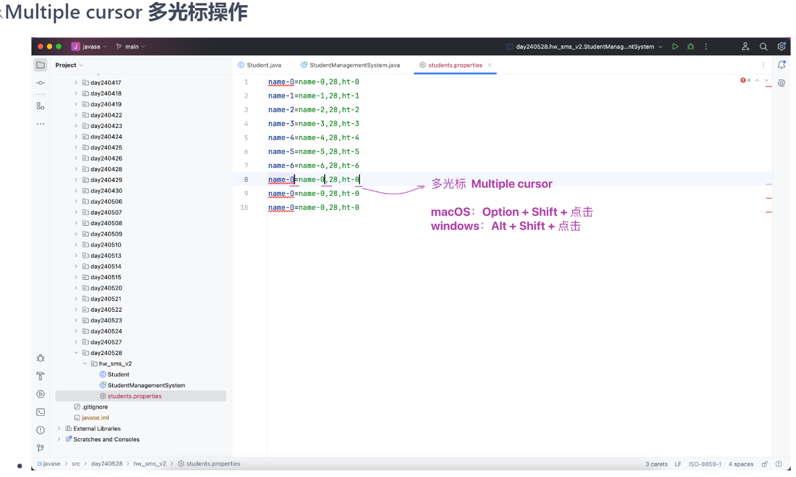
- 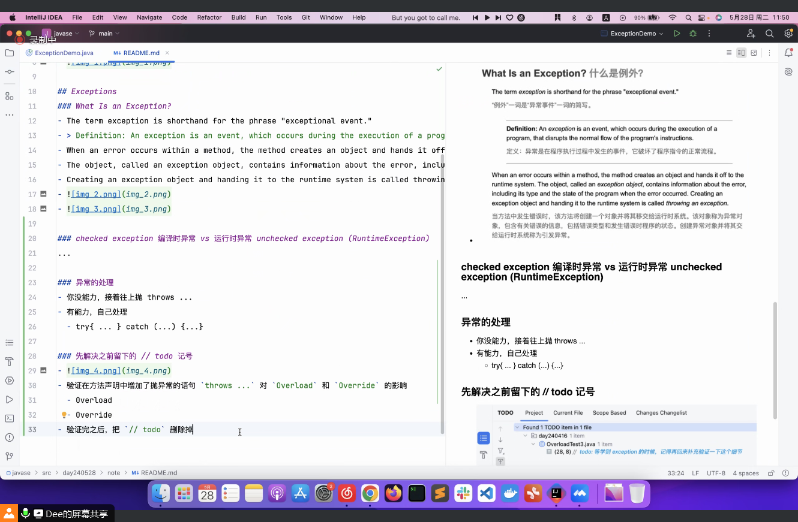
- 
- 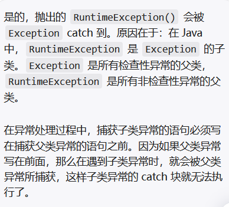
- 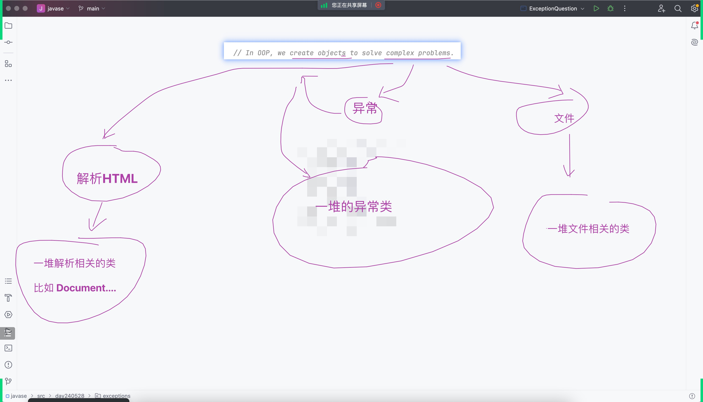
- 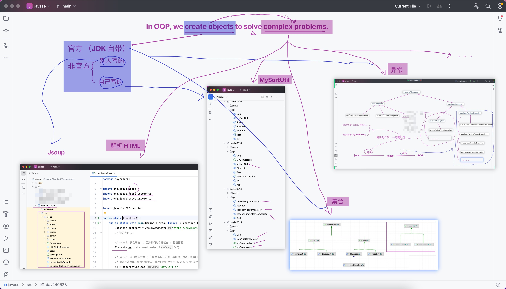