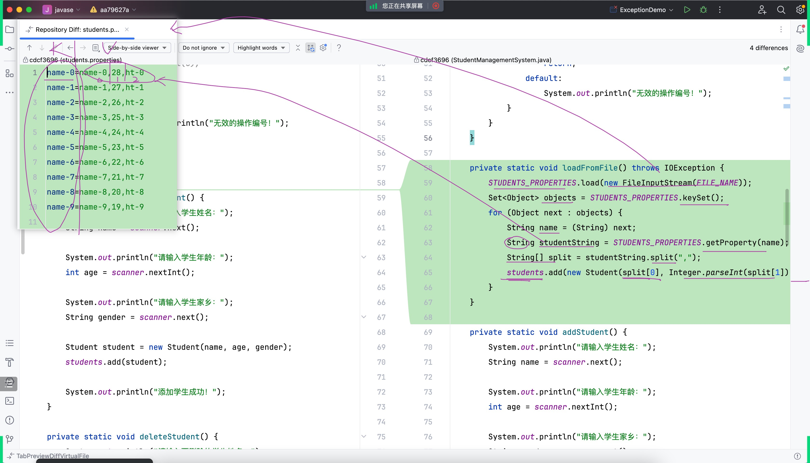

# Note 240528
## Review

### 异常
- 整体架构图
- 
- 
- 处理 得处理好 不然会出事故  
- e.getMessage();
- e.printStackTrace();
- try - catch - finally
  - 无论如何都会执行到代码 哪怕出现了异常
  - 

## 截图寄存处
- 
- 
- 
- 
- 
- 
- 
- 
- 
- 
- 
- 