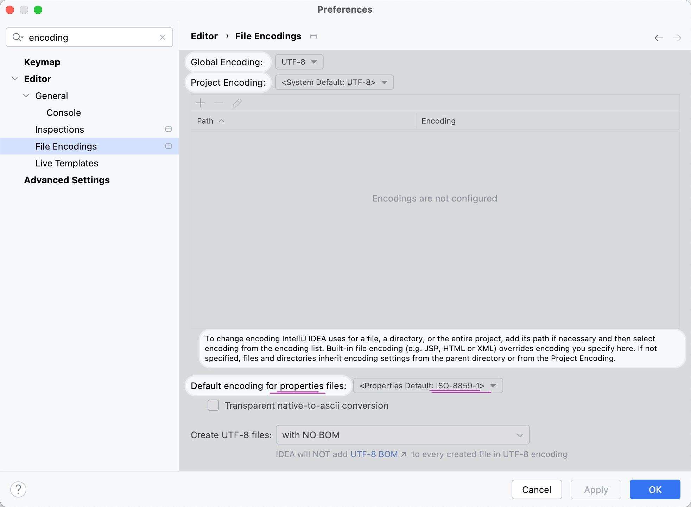
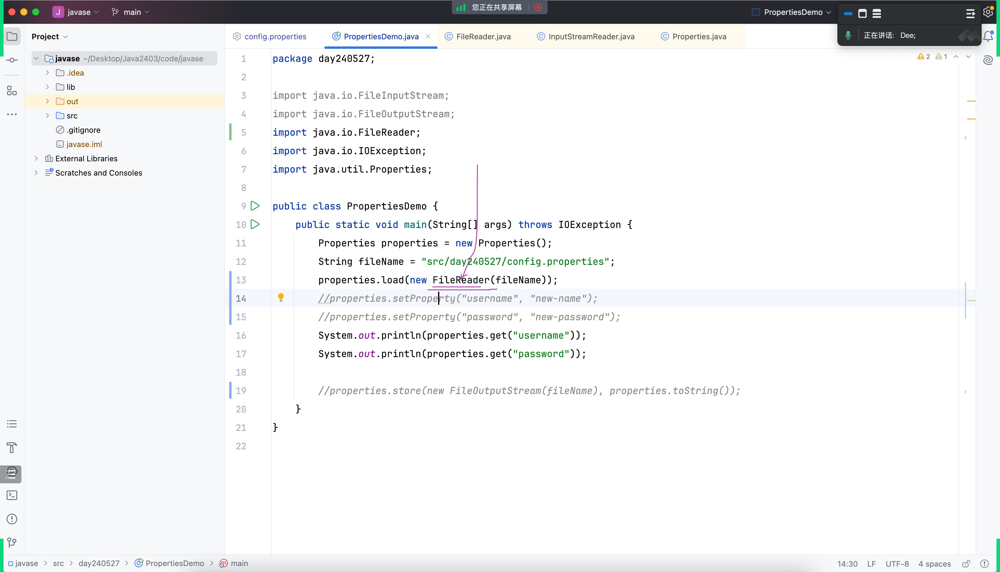

# Note 240603
## Review

### 配置文件编码问题 (Default encoding for properties files)
- 
- 

### 截图寄存器
- 
- 

## 阶段项目代码编写提示
- 先轮廓，后细节
- 不要被小细节绊住脚步，维度提升

## 额外任务
当前版本写完之后，思考...
- 可以把现阶段的重要知识点都融合进当前项目中
- 不止下载一页，可配置
- 不止获取标题，还有正文
- 正文中不止有文字，还有图片...