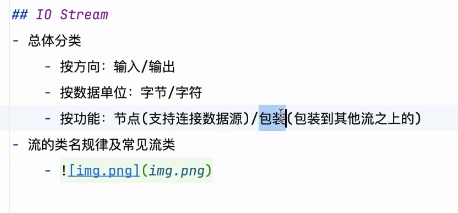

# Note day240604
## Review

### IO Stream
- 总体分类
  - 按方向:输入/输出
  - 按数据单位:字节/字符
    - read(缓冲区) 
    - 以字节为单位 (看名称)
      - 
    - 以字符为单位 (看名称)
      - 
  - 按功能:节点(直接连接数据源)/包装(包装到其他流之上的)
- 
- 流的类名规律及常见流类
  - 
- 序列化
  - 强烈建议除enum类型外的所有可序列化类显式声明serialVersionUID值
  - 写出去
- 反序列化
  - 读进来
### catch 的合并写法
- 

### ObjectStream
- 序列化接口 (Serializable)
  - 类要想读出来写出去 都要实现序列化接口
  - 只要是想写出去的类都要实现序列化接口 (Serializable)
    - 
- 定义版本 
  -  serialVersionUID
  - 不写 , 如果后续要读的对象做了更改 就读不出来了(会报错)
  - 
- 不想被序列化
  - 加个关键字 transient
    - 当你将一个对象序列化到文件时，你可能不希望所有的属性都被写入到文件中。此时，你可以使用 transient 关键字来修饰这些你不希望序列化的变量。
    - 

### 正则表达式
- 练习网站
  - https://regexlearn.com/zh-cn/learn/regex101
- 
- 
- 

### 模式匹配

### Java 中 关于时间
- https://docs.oracle.com/javase/tutorial/datetime/index.html

### Java 中 关于反射
- https://docs.oracle.com/javase/tutorial/reflect/index.html

### 截图寄存器
- 
- 
- 
- 
- 