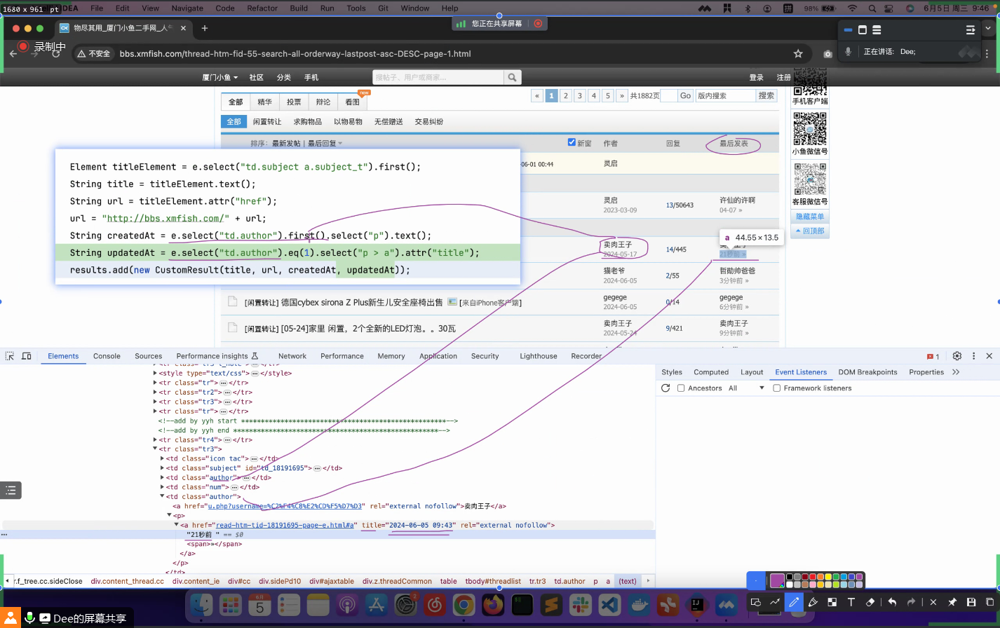
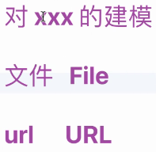
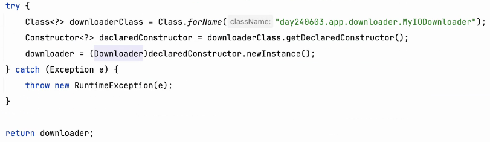
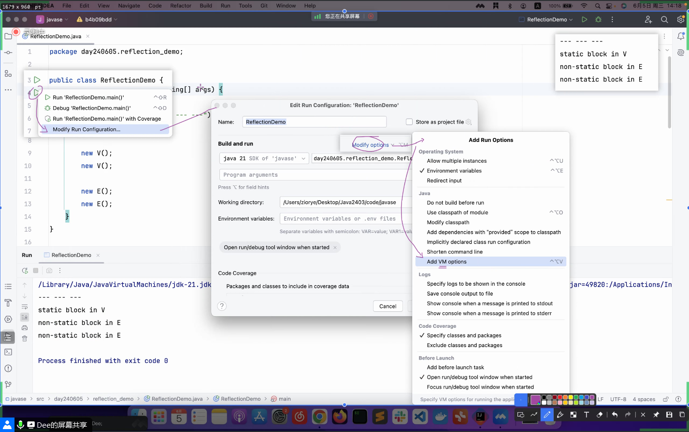
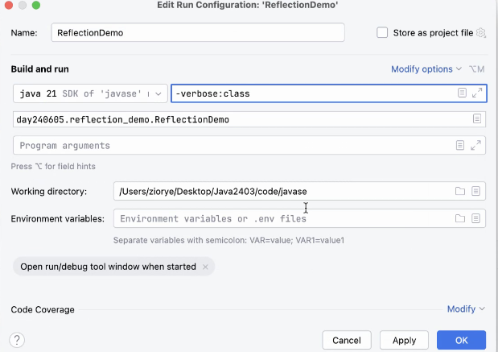

# Note 240605

## Review

### 正则表达式
- 关注 Pattern 类 
  - Pattern.compile()
  - Pattern.matcher
- 详细的正则表达式规则，不用死记硬背，可以自己阅读 Pattern 源码的文档注释

### 网页解析是这么抓取信息的
- 

### 一切 皆对象
- 

### DateTime 时间相关的类
- now() 系列
  - LocalDate
    - LocalDateTime.now()
  - LocalTime
    - LocalTime.now()
  - LocalDateTime
    - LocalDateTime.now()
- of() 系列
  - LocalDate.of()
  - LocalTime.of()
  - LocalDateTime.of()
- get() 系列
  - LocalDateTime localDateTime = LocalDateTime.now()
    - localDateTime.getDayOfYear()
    - localDateTime.getDayOfMonth()
    - localDateTime.getDayOfWeek()
    - localDateTime.getMonth()
    - localDateTime.getMonthValue()
    - localDateTime.getHour()

### 反射
- 
- 

### 虚拟机
- 
- -verbose:class
- 

### 截图寄存处
