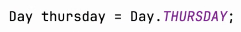
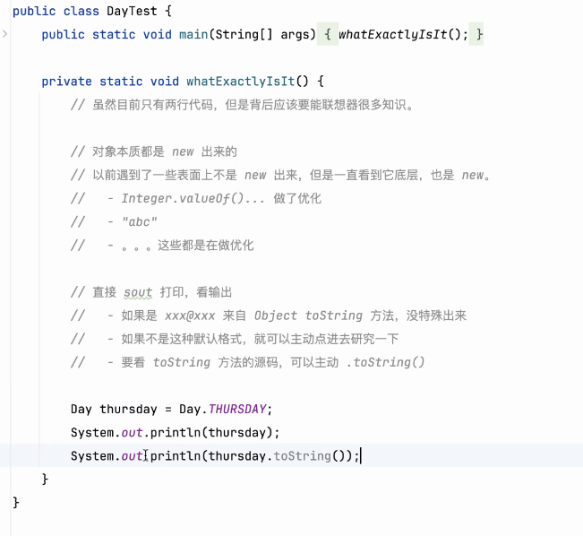
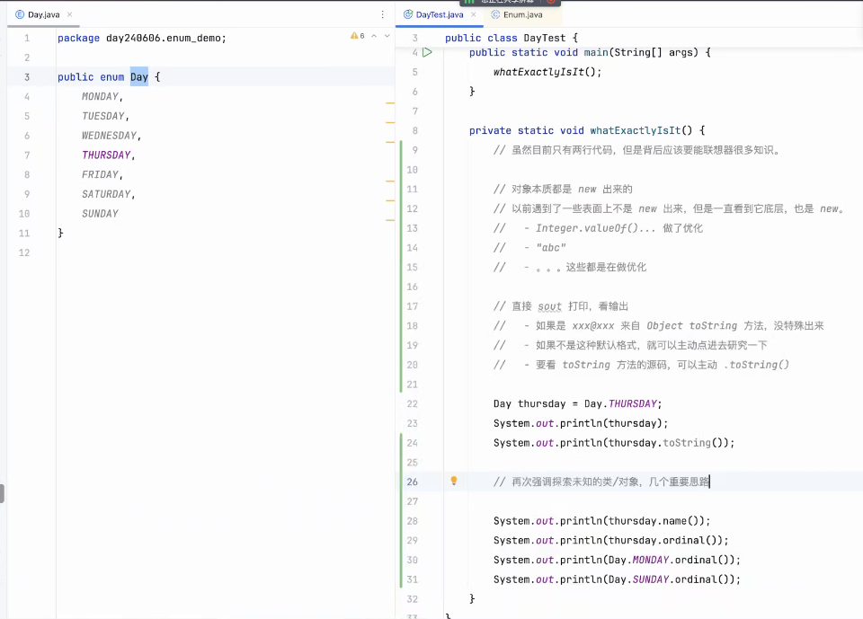
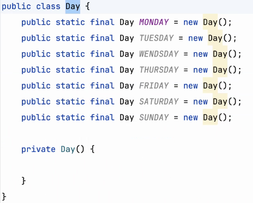
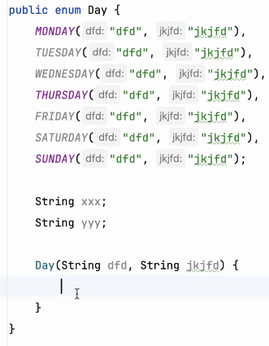
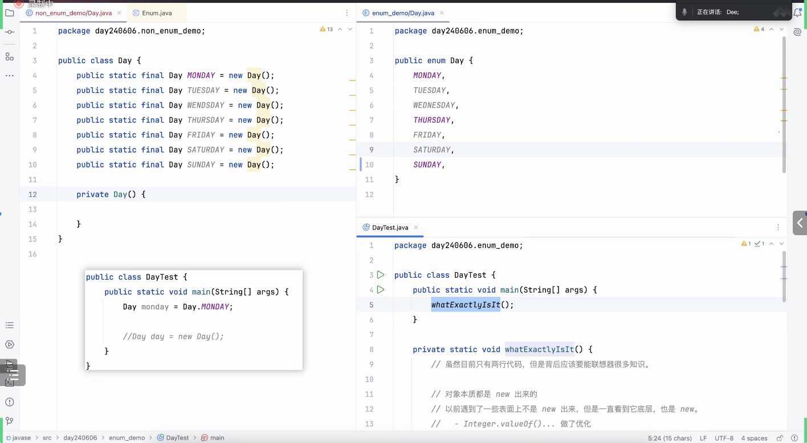

# Note 240606
## Review

### 枚举
- 
- 联系起一些学习方法 对于自学和探索很重要
  - 
  - 
  - 造出来
  - 打印出来
  - .toString 看看源码
- 
- 应用场景 或者 本质 : 一个类 就只有确定的那么几个对象 或者 只要 new 那几个
  - 比如 : 12个月份 , 每周的七天
  - 本质上就是做这件事
    - 
- 加 state ,behavior
  - 
- 
- ll enums implicitly extend java.lang.Enum
- 方法
  - valueOf(...)
  - 
### 截图寄存处