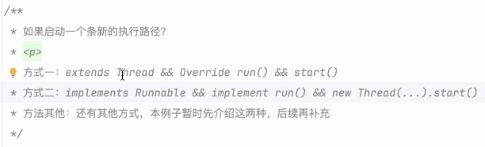
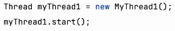
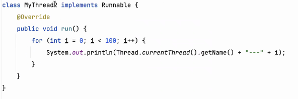
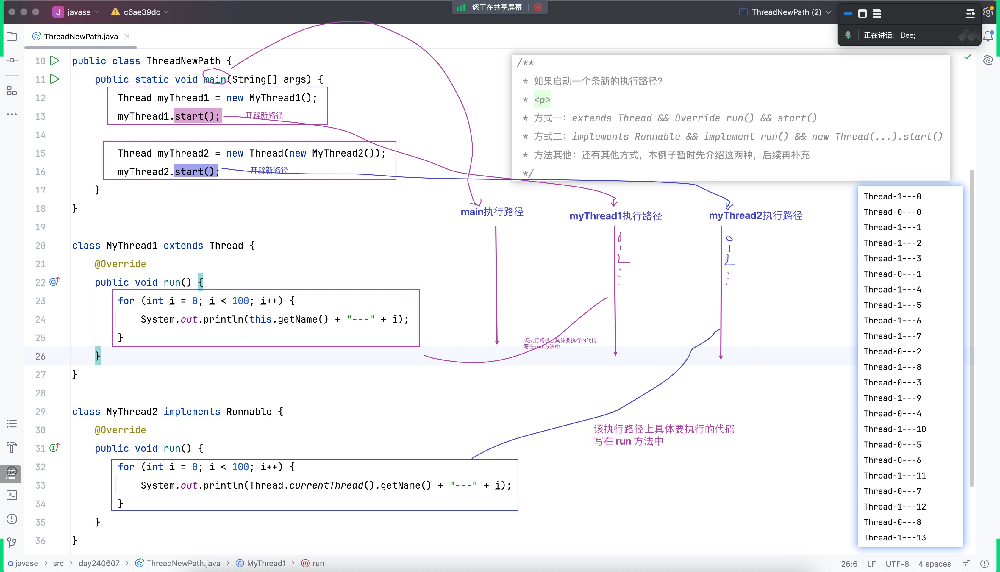
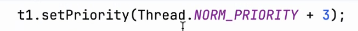
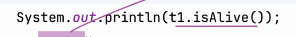
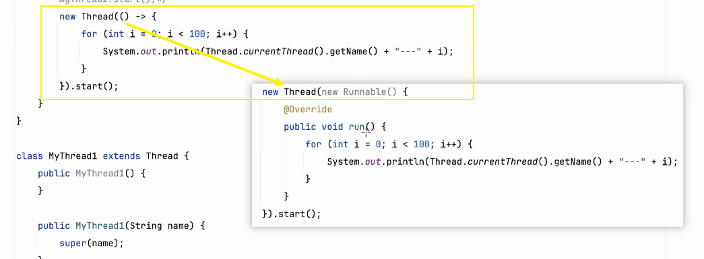

# Note 240607
## Review

### 多线程
- 如何启动多线程
  - 
  - 方式 1 : 
    - 
    - 
  - 方式 2 :
    - 
    - 
  - 要执行的代码放到 run() 的方法体里面
  - 开辟新线程 : 调用方法 start()
  - 获取名称
    - 
    - 
  - 
- 方法
  - Thread.sleep()
    - 睡眠 
  - join()
    - 是用来让当前执行线程等待 join() 方法所属的线程完成，然后再继续执行。
  - Thread.yield()
    - 主动让出处理机资源
  - setPriority()
  - 
    - Thread.NORM_PRIORITY
      - 优先级权限 
  - isAlive()
  - 
    - 用来检查一个线程是否还在运行 返回类型 Boolean
### lambda
  - 
  - 
### 截图寄存处
