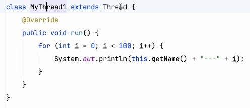
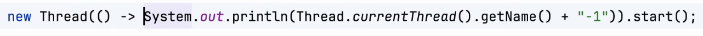

# Note 240607
## Review

### 多线程
- 如何启动多线程
  - 
  - 方式 1 : 
    - 
    - 
  - 方式 2 :
    - 
    - 
  - 要执行的代码放到 run() 的方法体里面
  - 开辟新线程 : 调用方法 start()
  - 获取名称
    - 
    - 
  - 
- 方法
  - Thread.sleep()
    - 睡眠 
  - join()
    - 是用来让当前执行线程等待 join() 方法所属的线程完成，然后再继续执行。
  - Thread.yield()
    - 主动让出处理机资源
  - setPriority()
  - 
    - Thread.NORM_PRIORITY
      - 优先级权限 
  - isAlive()
  - 
    - 用来检查一个线程是否还在运行 返回类型 Boolean
### lambda
  - 
  - 

### synchronized
- 直接写在方法声明中
- synchronized (this){}
- synchronized (***.class)

### Queue
- 在 Java 中，Queue 是 Java 集合框架的一部分，它是一个接口，主要用于存储元素并按照特定的顺序（例如 FIFO，即先进先出）进行处理。Queue 接口的实现类常用于处理具有某种特定顺序规则的元素集合。
- ### ConcurrentLinkedQueue
  - ConcurrentLinkedQueue 是 Queue 接口的一个线程安全的实现类。它使用了一种非阻塞的线程安全技术——CAS（Compare and Swap），来保证多线程环境下的线程安全。
  - ConcurrentLinkedQueue 是一个适用于高并发场景的队列，它通过链表结构来存储队列中的元素。由于它是一个无界队列，所以在添加元素时不会因为容量限制而失败（除非内存不足）。
  - ConcurrentLinkedQueue 支持所有的 Queue 接口方法，包括 add、offer、remove、poll、peek 等。这些方法都是通过 CAS 操作来保证线程安全的。除此之外，ConcurrentLinkedQueue 还提供了一些用于并行处理的方法，如 iterator() 方法返回的迭代器是弱一致的，也就是说在迭代过程中即使有其他线程修改了队列，也不会抛出 ConcurrentModificationException。

### 截图寄存处
