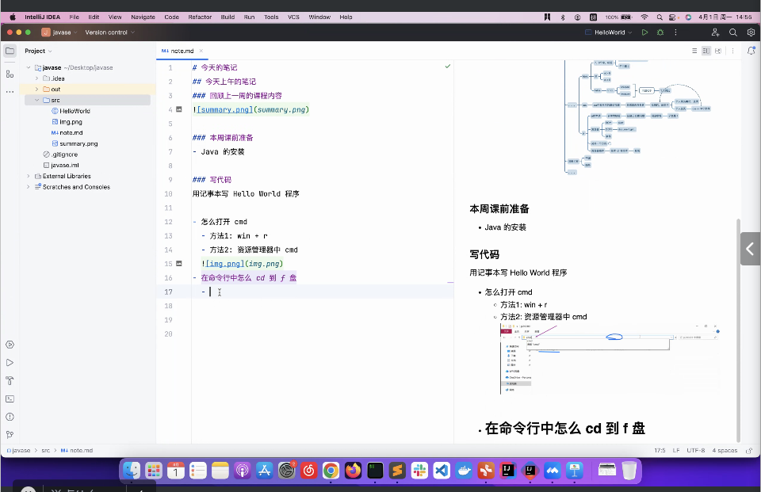
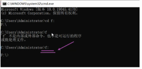
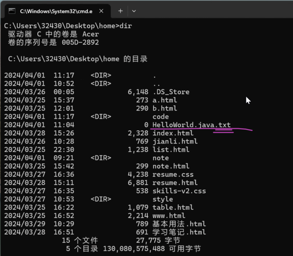
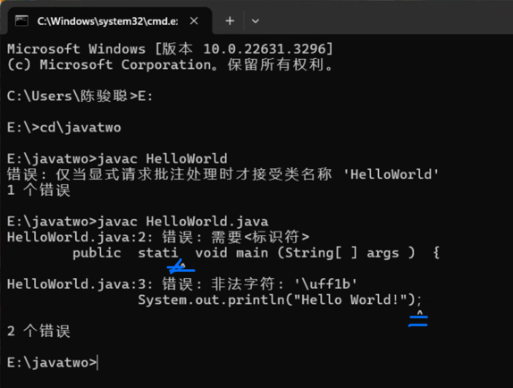
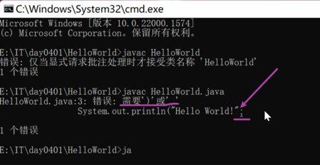
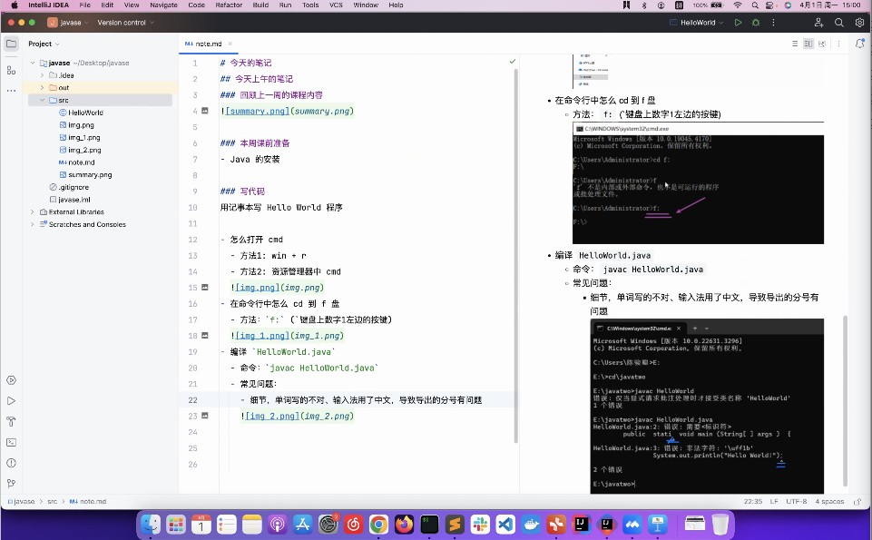

# 今天的笔记
## 今天上午的笔记
### 回顾上一周的内容

###本周的课前准备
-java的安装

###写代码
用记事本写Hello World

- 怎么打开 cmd
  - 方法1:win+r
  - 资源管理器中 cmd
- 在命令行怎么cd到f盘
  -方法: `f:`(数字键1旁边的`)
  
- 编写 `HelloWorld.java` 出现了一个常见问题：文件后缀的问题
- 比如：`HelloWorld.java.txt`
  
- 解决办法
  
- 编译 `HelloWorld.java`
    - 命令：`javac HelloWorld.java`
    - 常见问题：
        - 单词写的不对、输入法用了中文，导致导出的分号有问题
        - 
        - 少了一个括号
        - 

